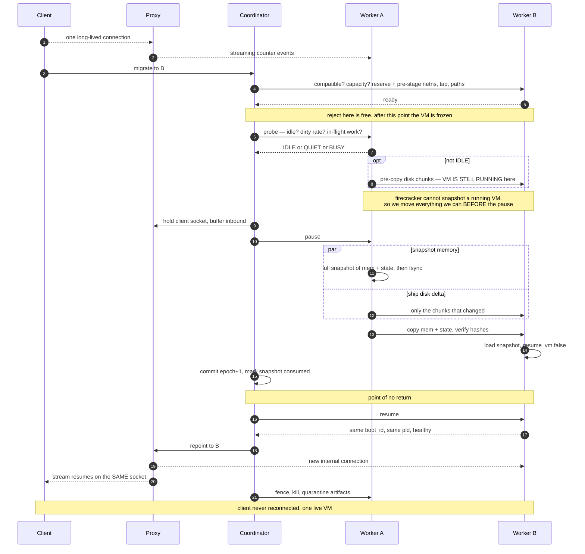
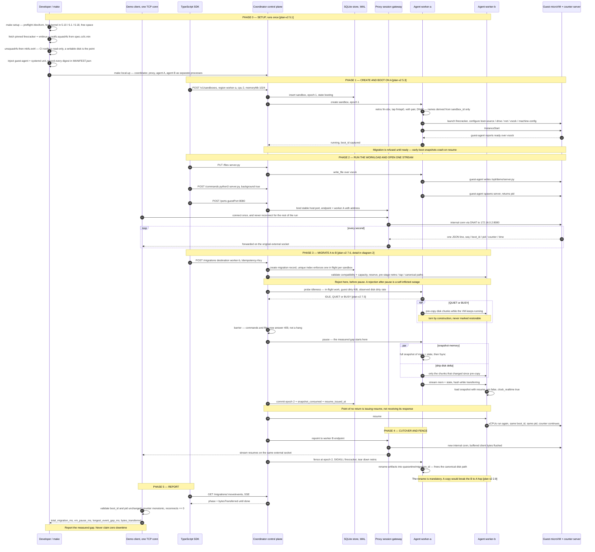

# System Diagrams

Four views of the system described in [`plan-v2.md`](../plan-v2.md).
Diagram 0 is the architecture. Diagrams 1-3 are sequence diagrams: protocol
summary, full demo run, and in-depth migration flow.

## Diagram 0 — Architecture

```mermaid
graph TB
    subgraph "packages/common — Shared Types & Protocol"
        direction TB
        CP[protocol/]
        CP1[errors.ts — ErrorCode, FiremigError]
        CP2[phases.ts — SandboxState, MigrationPhase]
        CR[runtime/]
        CR1[backoff.ts — exponential retry]
        CR2[faults.ts — fault injection]
        CR3[hash.ts — sha256, isErrorEnvelope]
        CT[types/]
        CT1[sandbox.ts — SandboxInfo, CommandResult]
        CT2[migration.ts — MigrationProgress, MigrationMetrics]
        CT3[artifacts.ts — CompatibilityManifest, ArtifactDescriptor]
    end

    subgraph "packages/sdk — TypeScript Client"
        direction TB
        SC[client/]
        SC1[options.ts — FiremigClientOptions]
        SC2[request.ts — sendRequest, retry logic]
        SC3[sandbox.ts — Sandbox class]
        SC4[migration.ts — Migration class, watch]
        SC5[migration-progress.ts — parseProgress]
        SP[phoenix/]
        SP1[protocol.ts — PhoenixMessage, WebSocketLike]
        SP2[socket.ts — PhoenixSocket, join/push]
        SP3[pending.ts — PendingReplies, dispatchFrame]
        SP4[connect.ts — attachSocket, heartbeat]
        SCLI[client.ts — FiremigClient facade]
        SWS[websocket.ts — PhoenixCommandTransport]
    end

    subgraph "packages/agent — Worker Agent"
        direction TB
        AA[artifacts/]
        AA1[transfer.ts — pullArtifact]
        AA2[artifact-range.ts — openArtifactRange]
        AA3[manifest.ts — assertCompatible]
        AP[planning/]
        AP1[network-plan.ts — networkCreatePlan]
        AP2[port-plan.ts — exposePortPlan]
        AP3[process-plan.ts — firecrackerLaunchPlan]
        APL[platform/]
        APL1[adapters.ts — FileSystemAdapter, ProcessAdapter]
        APL2[epochs.ts — EpochStore]
        APL3[paths.ts — PathModel, SandboxPaths]
        APL4[processes.ts — ProcessLifecycle]
        AR[runtime/]
        AR1[firecracker.ts — FirecrackerClient]
        AR2[vsock.ts — VsockGuestClient]
        AR3[relay.ts — RelayLifecycle]
        AR4[network.ts — deriveNetworkIdentity]
        AS[server/]
        AS1[server.ts — buildAgentServer]
        AS2[routes-sandbox.ts — CRUD routes]
        AS3[routes-migration.ts — phase routes]
        AS4[routes-artifacts.ts — artifact streaming]
        AW[worker/]
        AWC[core/ — WorkerCore, ResourceAllocator]
        AWL[lifecycle/ — create, boot, pause, resume]
        AWM[migration/ — prepare, transfer, verify]
        AWS[snapshot/ — createSnapshot, manifest]
    end

    subgraph "packages/demo — Demo & Validation"
        direction TB
        DD[demo.ts — runDemo]
        DT[tcp.ts — TcpObserver]
        DV[validator.ts — validateContinuity]
        DVL[validation/]
        DVL1[events.ts — CounterEvent, parseCounterEvent]
        DVL2[sequence.ts — analyzeSequence]
    end

    subgraph "services/coordinator — Elixir Control Plane"
        direction TB
        CCL[clients/]
        CCL1[worker_client.ex — call worker agents]
        CCL2[proxy_client.ex — call proxy]
        CCMD[commands/]
        CCMD1[commands.ex — runCommand, writeFile]
        CCMD2[command_queue.ex — queue during migration]
        CCMD3[command_replayer.ex — replay after resume]
        CM[migrations/]
        CMS[schemas/ — Migration, MigrationEvent]
        CMO[orchestration/ — MigrationState, Reconciler]
        CMR[runner/]
        CMR1[migration_runner.ex — GenServer per migration]
        CMR2[phases/prepare.ex — reserve, prestage]
        CMR3[phases/cutover.ex — pause, snapshot, transfer]
        CMR4[phases/finalize.ex — resume, verify, fence]
        CS[sandboxes/]
        CS1[sandboxes.ex — create, get, list]
        CS2[exposure.ex — port exposure]
    end

    subgraph "services/proxy — Elixir Session Gateway"
        direction TB
        PS[session/]
        PS1[session.ex — Session GenServer]
        PS2[flow.ex — client/guest data flow]
        PS3[guest.ex — guest connection]
        PS4[sequence_filter.ex — dedup/reorder]
        PR[route/]
        PR1[route_state.ex — RouteState GenServer]
        PR2[route_manager.ex — repoint during migration]
        PA[admin_router.ex — internal HTTP API]
    end

    %% Cross-package dependencies
    SC --> CP
    SC --> CT
    AA --> CT
    AW --> CP
    AW --> CT
    DV --> DVL

    %% Service to package dependencies
    CCL1 --> AS
    CMR --> AS
    PA --> PS
```

### Module Responsibilities

| Layer | Module | Responsibility |
|-------|--------|----------------|
| **common** | `protocol/` | Error codes, state enums, phase definitions |
| | `runtime/` | Backoff, hashing, fault injection |
| | `types/` | Sandbox, migration, artifact DTOs |
| **sdk** | `client/` | HTTP request/response, Sandbox/Migration classes |
| | `phoenix/` | WebSocket multiplexing for real-time commands |
| **agent** | `artifacts/` | Pull, stream, verify snapshot files |
| | `planning/` | Generate `ip`/`nsenter`/`firecracker` command sequences |
| | `platform/` | Filesystem, processes, epoch fencing |
| | `runtime/` | Firecracker API, vsock, network relay |
| | `server/` | Fastify HTTP server, route handlers |
| | `worker/` | WorkerService: sandbox lifecycle + migration phases |
| **demo** | `validation/` | Counter event parsing, sequence analysis |
| **coordinator** | `clients/` | HTTP clients for workers and proxy |
| | `commands/` | Command queue during migration, replay after |
| | `migrations/` | MigrationRunner GenServer, phase handlers |
| | `sandboxes/` | Sandbox CRUD, port exposure |
| **proxy** | `session/` | Per-connection state, bidirectional relay |
| | `route/` | Route table, cutover repointing |

## Diagram 1 — Protocol flow (short)

Migration handshake only. Setup, boot, reporting omitted.

## Diagram 2 — Overview

## Diagram 3 — In-depth migration flow

```mermaid
sequenceDiagram
    autonumber
    participant C as Demo client
    participant PX as Proxy session gateway
    participant API as Coordinator
    participant ST as SQLite store
    participant RC as Reconciler
    participant AA as Agent A
    participant FA as firecracker A
    participant NA as netns fm-sbx on A
    participant VA as guest-agent over vsock
    participant SRV as counter server in guest
    participant ART as artifacts state / mem / disk
    participant AB as Agent B
    participant FB as firecracker B
    participant NB as netns fm-sbx on B

    Note over API,NB: PHASE 1 — ADMISSION. Everything here is reversible at zero cost
    API->>ST: upsert by Idempotency-Key
    alt same key, same request_hash
        ST-->>API: existing record
        API-->>C: 200 replay, same migrationId
    else same key, different body
        API-->>C: 409 IDEMPOTENCY_KEY_CONFLICT
    else another migration already in flight
        API-->>C: 409 MIGRATION_IN_PROGRESS with migrationId
    else fresh
        ST-->>API: new migration, phase PREPARING
    end
    API->>AA: build manifest — fc version + digest, snapshot format, host kernel, CPU vendor/model/family/stepping, cpu_template, vcpu, mem_size, smt, drive path, tap name, vsock path
    API->>AB: validate whole manifest against B, then reserve RAM + disk for mem + disk + staging, veth slot, netns slot, with expiry
    alt incompatible or no capacity or unreachable
        AB-->>API: reject
        API->>ST: phase FAILED, source never touched
        API-->>C: 412 INCOMPATIBLE_DESTINATION or 503 NO_CAPACITY
    end
    AB->>NB: create netns, tap fmtap0 172.16.0.1/30, veth, DNAT, MASQUERADE
    Note over NB,AB: tap name, guest IP, drive path and vsock path are snapshot-encoded,<br/>so they are derived from sandbox_id and are identical on both workers [plan-v2 5.4]
    AB->>AB: assert canonical /var/lib/firemig/sandboxes/sbx/rootfs.ext4 is FREE on B
    Note over AB,ART: If a stale generation still occupies that path, restoring B memory<br/>against A disk is exactly the memory/disk skew failure. Fail closed here

    Note over API,AB: PHASE 1b — PROBE AND PRE-COPY. VM is STILL RUNNING throughout
    Note over API,FA: Firecracker requires state Paused for /snapshot/create, full or diff.<br/>There is no snapshot-while-running mode. So the only lever is moving work<br/>out of the pause, not removing the pause [plan-v2 7.5]
    API->>ST: phase PROBING
    API->>VA: read /proc/meminfo Dirty + Writeback, loadavg1
    API->>AA: sample chunk hashes twice, 500 ms apart, count changed chunks
    AA-->>API: observed disk dirty rate
    alt IDLE — no in-flight mutations, dirty rate zero
        Note over API,AB: Fast path. Skip pre-copy, skip drain wait, skip quiesce.<br/>Post-pause disk delta is already zero
    else QUIET — rate low and not rising
        API->>ST: phase PRECOPYING
        loop until the rate converges or the round budget is spent
            AA->>AB: ship changed chunks while the guest keeps writing
            AB->>ART: store as a pre-pause generation
            Note over AB,ART: This generation is TORN and must never be marked restorable.<br/>It only exists to shrink the final delta
        end
    else BUSY — rate high or rising
        Note over API,AA: Safe path. Serial flow, longer pause, said out loud on the SSE stream
        opt caller gave deadlineMs with room to spare
            API->>API: re-probe and defer rather than freezing a hot VM
        end
    end
    alt pre-copy round fails, or rate never converges
        API->>AB: discard pre-pause generation, fall through to the safe path
        Note over API,AA: Source untouched. Pre-copy is an optimisation, never load-bearing
    end

    Note over API,SRV: PHASE 2 — BARRIER AND PAUSE. The pause clock starts here
    API->>ST: phase QUIESCING, barrier on
    C->>API: POST /commands during migration
    API-->>C: 409 MIGRATION_BARRIER with migrationId — explicit, not a hang, not silent loss
    opt options.quiesceGuest, default OFF
        API->>VA: fsfreeze
        Note over VA,ART: Off by default. A full memory snapshot already captures the guest<br/>page cache, so pause-at-T plus disk-at-T is exactly consistent. Flushing only<br/>buys a standalone disk artifact, and costs pause time [plan-v2 2.2]
    end
    API->>AA: PATCH /vm state Paused
    AA->>FA: PATCH /vm  Paused
    FA-->>AA: paused, vCPUs stopped
    AA-->>API: t_pause_issued recorded on the coordinator clock

    Note over AA,ART: PHASE 3 — SNAPSHOT AND SEAL. Two independent files, so do both at once
    par snapshot memory and state
        AA->>FA: PUT /snapshot/create  snapshot_type Full, snapshot_path, mem_file_path
        FA->>ART: write VM state file + full guest memory file
    and ship disk delta
        AA->>AB: re-hash disk chunks, ship only what changed since pre-copy
        Note over AA,AB: On the IDLE path this branch finds zero changed chunks<br/>and returns immediately. Pause costs max of the two, not the sum
    end
    AA->>ART: fsync state, mem, disk, and their containing directories
    Note over AA,ART: fsync is durability against source host loss.<br/>It is NOT needed for copy coherence — same host page cache [plan-v2 2.3]
    alt snapshot create fails
        AA->>ART: delete partials
        API->>AA: PATCH /vm  Resumed
        API->>VA: sync_clock — rollback also skews the guest clock [plan-v2 2.4]
        API->>ST: phase FAILED, source healthy
    end

    Note over AA,FB: PHASE 4 — TRANSFER AND VERIFY
    loop per artifact — mem and state, plus any disk chunk still outstanding
        AB->>AA: GET /internal/artifacts/:kind?offset=N
        AA-->>AB: byte range
        AB->>ART: write name.partial, stream SHA-256 as bytes land
        AB->>ST: bytesTransferred, surfaced on the SSE stream
    end
    Note over AB,ART: If the probe said IDLE and the guest woke up anyway, the delta here is<br/>simply bigger than predicted. Every hash is still checked, so a stale probe<br/>can only make a migration SLOWER, never wrong
    alt hash matches manifest
        AB->>ART: rename name.partial to final
        AB->>ART: publish the reconciled disk generation as restorable — only now
    else transfer interrupted
        AB->>AA: resume from last verified offset
    else hash mismatch or deadline exceeded
        Note over AB,API: No vCPU has run on B, so rollback is still safe
        AB->>ART: discard
        API->>AA: PATCH /vm  Resumed
        API->>VA: sync_clock
        API->>ST: phase ROLLED_BACK
    end

    Note over AB,FB: PHASE 5 — LOAD ON B, STILL PAUSED
    AB->>FB: launch firecracker in netns, unique api-sock
    AB->>FB: configure logger and metrics ONLY
    Note over AB,FB: Logger and metrics config is not saved in snapshots, so it must be<br/>re-sent. Every device and machine setting comes from the state file —<br/>do not re-send machine-config or drives before load [plan-v2 2.6, 5.4]
    AB->>FB: PUT /snapshot/load — snapshot_path, mem_backend File, resume_vm false, clock_realtime true
    FB->>ART: MAP_PRIVATE mmap of the memory file, pages fault in on demand
    Note over FB,ART: That mem file is immutable and must be retained for the whole life<br/>of the restored VM. Generation-scope its path, GC only on sandbox delete
    alt load rejected
        AB->>FB: kill, discard
        API->>AA: resume source, sync_clock
        API->>ST: phase FAILED
    end
    opt MMDS in use
        AB->>FB: repopulate data store — not persisted across snapshots
    end

    Note over API,ST: PHASE 6 — THE OWNERSHIP BOUNDARY
    API->>ST: ONE transaction — snapshot_consumed true, epoch 1 to 2, resume_issued_at, phase RESUMING
    Note over API,ST: Commit BEFORE the resume call. Single-use snapshots stop a retry from<br/>quietly restoring the same state twice and duplicating UUIDs and RNG state
    API->>AB: resume
    AB->>FB: PATCH /vm  Resumed
    alt resume acknowledged
        FB->>SRV: vCPUs run, same boot_id, same pid, counter continues
    else resume RPC times out
        Note over API,FB: Destination MAY be running. Fail closed
        API->>AA: fence at epoch 2 — stay paused, refuse resume, refuse mutations
        API->>ST: phase ORPHANED_AMBIGUOUS, operator inspects
    end
    AA->>AA: any late request at epoch 1 now gets 409 FENCED, enforced at the agent

    Note over API,SRV: PHASE 7 — REPAIR AND VERIFY
    API->>VA: sync_clock — guest wall clock resumed frozen at snapshot time
    Note over VA,SRV: clock_realtime fixes KVM clock, guest still needs hwclock or an NTP step.<br/>Firecracker 1.15+ VMClock exposes a generation counter for guests that must notice
    API->>VA: health — agent responds, boot_id unchanged, pid unchanged, counter not decreased
    alt health fails after resume
        Note over API,AA: Do NOT resume the source. State has already diverged
        API->>ST: recover destination, never revert ownership
    end

    Note over C,NA: PHASE 8 — CUTOVER AT THE PROXY
    API->>PX: beginCutover was issued before pause, buffer bounded
    FA--xPX: internal conn died at pause
    Note over PX,C: The proxy MUST NOT forward that EOF. During a cutover window an<br/>internal EOF is a reconnect trigger, not a close. Propagating it makes the<br/>client exit cleanly and invalidates a migration that actually worked
    API->>PX: repoint to worker B veth endpoint
    PX->>NB: dial with jittered backoff, DNAT to 172.16.0.2:8080
    PX->>SRV: connected — the listener was already inside the snapshot
    PX-->>C: flush buffer, resume forwarding on the ORIGINAL external socket
    PX->>API: gap_ms, last byte out to first byte out, single clock
    API-->>ST: t_resume_acked, vm_pause_ms closed

    Note over AA,ART: PHASE 9 — FENCE, QUARANTINE, CLEANUP
    API->>AA: SIGKILL firecracker A
    AA->>NA: tear down DNAT, veth, tap, netns
    AA->>ART: rename canonical rootfs.ext4 and snapshot files into quarantine/migration_id
    Note over AA,ART: A move, not a copy. The drive path is snapshot-encoded and identical on<br/>both workers, so leaving it occupied breaks the next B to A hop [plan-v2 2.9]
    API->>ST: phase CLEANUP then DONE
    alt cleanup fails
        AA->>ART: keep quarantined, retry async
        Note over AA,API: Ownership never changes during cleanup
    end

    Note over RC,ST: CRASH RECOVERY — orthogonal to all of the above
    RC->>ST: on coordinator restart, scan non-terminal migrations
    alt resume_issued_at is null
        RC->>AA: roll forward or resume source and sync_clock
    else resume_issued_at is set
        RC->>AB: destination owns the VM, drive to CUTOVER or ORPHANED_AMBIGUOUS
    end
    Note over RC,ST: Every phase transition is one committed transaction, so the reconciler<br/>needs nothing but durable state to reach a terminal, single-owner outcome
```

## Reading the diagrams together

| Concern | Architecture | Protocol | Overview | In-depth |
| --- | --- | --- | --- | --- |
| Where code lives | Diagram 0 modules | — | — | — |
| Where rejection is cheap | — | step 5 note | Phase 3 note | Phase 1, before any pause |
| What the pause actually covers | — | steps 7 to 14 | Phase 3 | Phases 2 to 6 |
| Why the client never reconnects | proxy/session | step 17 | Phase 4 | Phase 8, EOF suppression |
| Why exactly one VM is live | worker/migration | steps 13, 18 | Phase 4 fence | Phase 6 epoch commit, Phase 9 fence |
| Why A to B to A works twice | worker/snapshot | not shown | Phase 4 note | Phase 1 assert plus Phase 9 rename |
| How the pause is kept short | migrations/runner | steps 5 to 15 | Phase 3 probe + par | Phase 1b probe/pre-copy, Phase 3 par |
| Why the probe cannot corrupt anything | — | not shown | not shown | Phase 4 note |
| What happens if the coordinator dies | migrations/orchestration | not shown | not shown | Crash recovery block |
