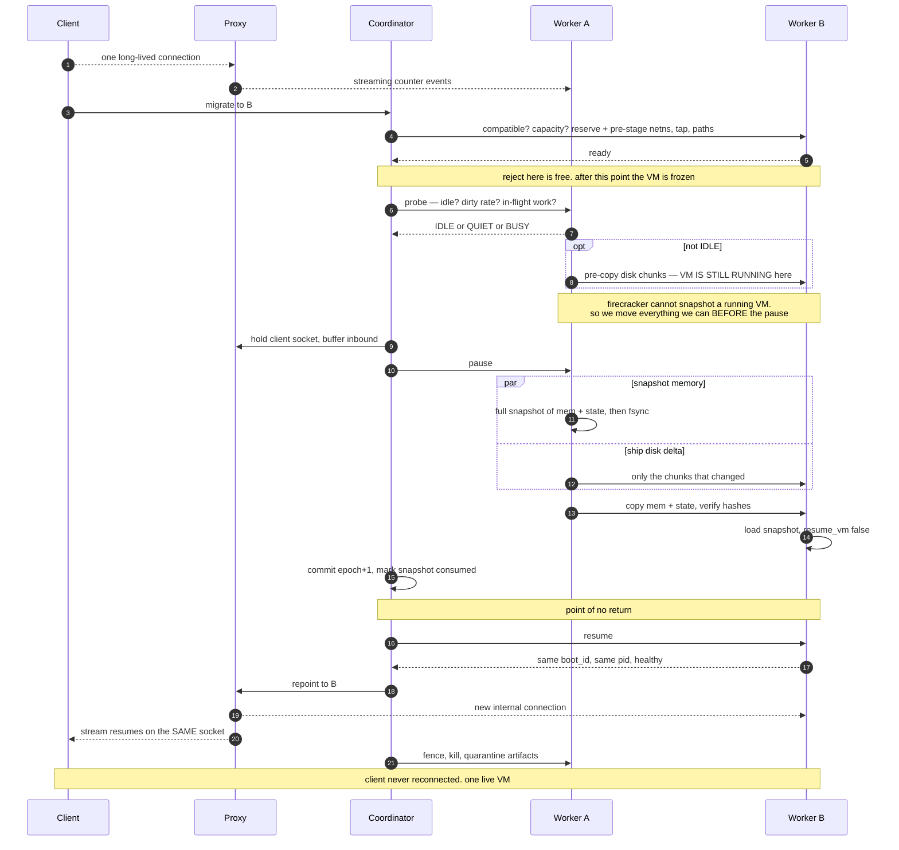
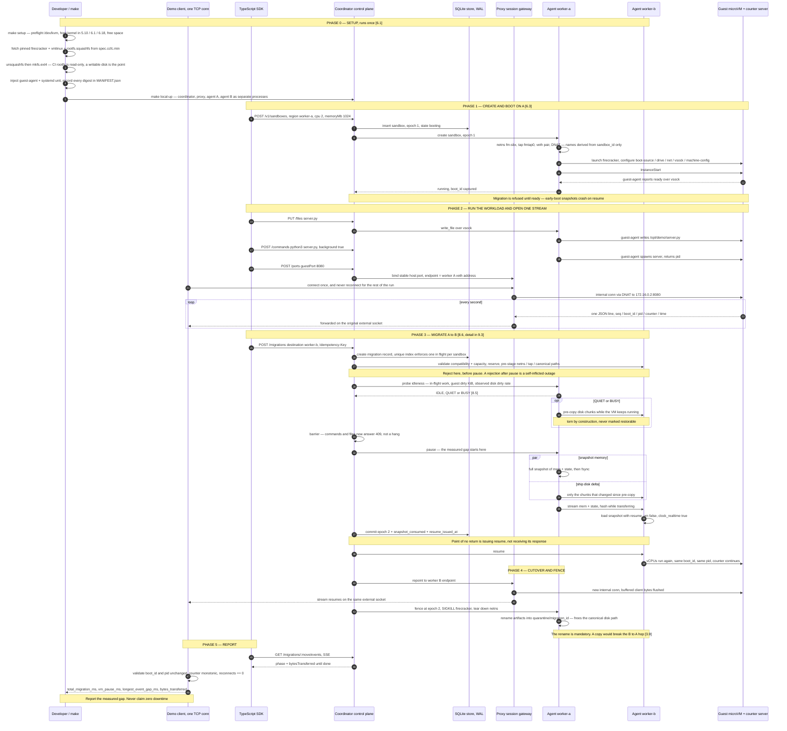

# Firecracker Live Migration — Master Plan

Single source of truth: the problem, the verified constraints, the system to
build, and the path from two local workers to two regions.

## Contents

| Part | Subject |
| --- | --- |
| [0](#part-0--the-problem) | The problem, restated from `README.md` |
| [1](#part-1--how-this-plan-is-organised) | Build-now and scale-later, and how to read this |
| [2](#part-2--verified-ground-truth) | Primary-source facts everything rests on |
| [3](#part-3--design-rules) | Twelve rules the design must hold to |
| [4](#part-4--environment-decision) | Where this actually runs |
| [5](#part-5--deliverables-mapped-to-the-readme) | Requirement → artifact |
| [6](#part-6--system-design) | Repo, isolation, boot, resource table, guest agent |
| [7](#part-7--proxy-session-gateway) | The stable client-facing address |
| [8](#part-8--migration-protocol) | Phases, store, fencing, transfer, pause minimisation, sequence, failures |
| [9](#part-9--diagrams) | Three sequence diagrams |
| [10](#part-10--demo-and-validator) | Proving it really migrated |
| [11](#part-11--control-api-and-sdk) | HTTP surface and TypeScript SDK |
| [12](#part-12--tests) | Fault injection and the test matrix |
| [13](#part-13--hour-by-hour-budget) | 8–12 hours, with a cut list |
| [14](#part-14--scale-path-local--two-regions) | The full production design |
| [15](#part-15--sources) | Every citation |

## Part 0 — The problem

### 0.1 The requirement

Build a small system that demonstrates how a running Firecracker microVM could
move from one region to another. Run a server inside the VM. While a client is
connected to it, move the VM from worker A to worker B. The VM and server
process must continue from the same state, and the client must keep receiving
data after a short interruption.

This may run on two cloud hosts in different regions, or locally on one Linux
machine with two isolated workers.

### 0.2 Firecracker must be used directly

The system must start and manage the Firecracker processes, guest kernel, root
filesystem, machine configuration, API sockets, TAP devices and networking. It
must create the snapshots, move the required state, and restore the VM on the
destination worker.

Cloud infrastructure is allowed — ordinary compute instances or bare-metal Linux
hosts with KVM, networking and storage. **Not** allowed as the implementation:
the provider's snapshot, live-migration or managed-sandbox API. **Not** allowed
as a substitute for the microVM: a container, a QEMU VM, or a restarted process.

Firecracker gives snapshot and restore primitives. It does not give a complete
migration system. The system must handle:

- compatible source and destination hosts
- memory and VM state transfer
- writable disk state
- a stable client-facing address
- traffic while the VM is paused
- destination readiness and source fencing
- retries, rollback and cleanup
- migration progress and failure reporting

**Only one copy of the VM may be active after cutover. If restore fails, the
source VM must be able to resume.**

### 0.3 The minimum baseline

1. Two isolated workers on compatible Linux/KVM hosts, or on one Linux/KVM machine.
2. Create and boot a Firecracker VM on worker A.
3. Run a small counter server inside the VM.
4. Connect a client through a stable TCP or HTTP streaming proxy.
5. Pause the VM and create a full Firecracker snapshot.
6. Copy the VM state, memory and required disk state to worker B.
7. Restore the snapshot in a new Firecracker process on worker B.
8. Point the proxy at the restored VM and resume the client stream.
9. Stop worker A only after worker B is healthy.

The external client connection to the proxy must remain open. The proxy may open
a new internal connection to the restored VM. A raw TCP connection between proxy
and guest need not be preserved.

### 0.4 Control API and SDK

```text
POST /v1/sandboxes                         create a Firecracker VM
POST /v1/sandboxes/:id/commands            run a command
PUT  /v1/sandboxes/:id/files               write a file
POST /v1/sandboxes/:id/ports               expose a guest port
POST /v1/sandboxes/:id/migrations          start a migration
GET  /v1/sandboxes/:id/migrations/:move    read migration progress
GET  /v1/sandboxes/:id                     inspect the VM and current region
```

The SDK should feel approximately like this:

```ts
const sandbox = await client.sandboxes.create({
  region: "worker-a",
  cpu: 2,
  memoryMb: 2048,
});

await sandbox.files.write("/opt/demo/server.py", serverSource);
await sandbox.commands.run({
  command: "python3 /opt/demo/server.py",
  background: true,
});

const port = await sandbox.ports.expose({ guestPort: 8080 });
const migration = await sandbox.migrate({ destination: "worker-b" });

for await (const progress of migration.watch()) {
  console.log(progress.phase, progress.bytesTransferred);
}
```

Request, response, idempotency and failure semantics are ours to choose. The API
and SDK need only enough functionality to run the demonstration.

### 0.5 Proving it really migrated

The in-guest server emits something like this every second over one long-lived
connection:

```json
{"boot_id":"8b9...","pid":417,"counter":38,"time":"2026-07-25T10:00:00Z"}
```

The automated demo must:

1. create a Firecracker sandbox on worker A
2. write and start the server inside it
3. expose the port and open one streaming connection
4. collect events before migration
5. migrate the running VM to worker B **without reopening the client connection**
6. continue collecting events after migration
7. report total migration time, VM pause time, longest event gap, bytes moved,
   and whether boot ID, PID and counter remained continuous

Booting a new VM and restarting the server does not count. Neither does hiding a
restart behind a reconnecting client.

### 0.6 Local testing bar

Local support is recommended, not required. A reviewer should be able to run
commands equivalent to:

```bash
make setup       # check KVM and fetch pinned Firecracker, kernel and rootfs assets
make local-up    # start the proxy and two isolated workers
make demo        # run the connected-server migration demonstration
make test        # run correctness and failure tests
```

Names may differ. The experience must not require manually assembling a kernel,
rootfs, TAP device or Firecracker API request. Workers on one machine must have
separate Firecracker processes, working directories, API sockets, and network
namespaces or equivalent isolation.

### 0.7 Reliability first

These five will be tested: successful migration, an unavailable destination, an
interrupted state transfer, a repeated migration request, and A → B → A
migration while the workload is active.

Use a reliable full snapshot path. **Measure the VM pause and network gap
instead of claiming zero downtime.**

### 0.8 Not required

- a production multi-tenant sandbox platform
- a deployment in two paid bare-metal cloud regions
- zero-downtime or raw guest TCP connection migration
- differential snapshots, dirty-page pre-copy or demand paging
- a distributed scheduler
- support for large VMs or many concurrent migrations

Briefly explain how the design would go from two local workers to two compatible
hosts in different regions. Aim for roughly 8–12 focused hours. **Prefer a
smaller system that works and recovers correctly over an ambitious incomplete
one.**

### 0.9 Quality bar

Reliability, code quality, tests, documentation, project structure. Coding agents
are fine; we own the complete result. Share code, setup instructions, automated
demo, tests, and the important decisions.

## Part 1 — How this plan is organised

Two layers, deliberately separated.

- **§2–§13 is what gets built.** In order, with an hour budget and a cut list.
  §0 asks for a working system in roughly 8–12 focused hours, so this layer is
  concrete down to the request schemas and the Makefile targets.
- **§14 is the scale path.** The multi-region design — regional worker pools,
  content-addressed chunk storage, atomic manifests, conservative GC, overload
  control. None of it is required for the deliverable, and it answers §0.8's
  closing ask about going from two local workers to two compatible hosts in
  different regions.

Three things decide the shape of everything downstream, and they are settled
before any code:

1. **Where it runs.** Firecracker requires Linux and `/dev/kvm`; the development
   host is macOS on Apple Silicon. This also fixes the architecture, and
   `x86_64` vs `aarch64` changes which CPU templates and API fields exist. §4.
2. **What Firecracker actually guarantees.** Snapshot/restore has hard edges —
   what is not saved, what must match between hosts, what breaks on resume. All
   checked against primary sources in §2, because guessing here produces a design
   that looks right and corrupts guests.
3. **Twelve rules** the implementation must hold to, in §3. Each one exists
   because the obvious alternative is wrong: notably that host resource names
   must derive from `sandbox_id` rather than the worker (§3.1), and that
   quarantining source artifacts must free the canonical disk path or the
   A → B → A test in §0.7 restores mismatched memory and disk (§3.9).

Read §2 → §3 → §4 before §6. Everything after that is implementation.

## Part 2 — Verified ground truth

Everything in §3–§13 rests on these. Each was checked against a primary source
in August 2026; citations in §15.

### 2.1 The API surface actually available

| Call | Body |
| --- | --- |
| Pause | `PATCH /vm {"state":"Paused"}` |
| Snapshot | `PUT /snapshot/create {"snapshot_type":"Full","snapshot_path":…,"mem_file_path":…}` |
| Restore | `PUT /snapshot/load {"snapshot_path":…,"mem_backend":{"backend_path":…,"backend_type":"File"},"resume_vm":false}` |
| Resume | `PATCH /vm {"state":"Resumed"}` |
| Actions | `PUT /actions` — `InstanceStart`, `FlushMetrics`, `SendCtrlAltDel` |

`PUT /snapshot/load` additionally accepts, per the API spec (1.17.0-dev):

- `network_overrides: [{ iface_id, host_dev_name }]` — retarget the TAP
- `vsock_override: { uds_path }` — retarget the vsock UDS
- `clock_realtime: bool` — x86_64 only, passes `KVM_CLOCK_REALTIME` to `KVM_SET_CLOCK`
- `track_dirty_pages` / `enable_diff_snapshots` (deprecated)

`MachineConfiguration`: `mem_size_mib`, `vcpu_count` (1 or even, ≤32),
`cpu_template` (`C3`|`T2`|`T2S`|`T2CL`|`T2A`|`V1N1`|`None`), `smt` (x86 only),
`huge_pages` (`None`|`Transparent`|`2M`), `track_dirty_pages`.

`Drive`: `drive_id`, `is_root_device`, `path_on_host`, `is_read_only`,
`cache_type` (`Unsafe`|`Writeback`), `io_engine` (`Sync`|`Async`), `partuuid`,
`rate_limiter`. `NetworkInterface`: `iface_id`, `host_dev_name`, `guest_mac`,
`mtu` (68–65535), rate limiters. `Vsock`: `guest_cid` (≥3), `uds_path`.

### 2.2 What a snapshot does and does not carry

**A snapshot cannot be created while the VM runs.** `PUT /snapshot/create` lists
"The microVM is `Paused`" as a hard prerequisite — for full *and* diff snapshots.
There is no snapshot-while-running mode.

Not saved:

- **Block device contents.** "The disk contents are *not* explicitly flushed to
  their backing files."
- **MMDS data store.** "The data store is not persisted across snapshots."
- **Metrics and logger configuration.** "These need to be reconfigured."
- **`MSR_IA32_TSX_CTRL` overwrites** on x86_64 without a CPU template.

Behaviour on restore:

- "Both network and vsock packet loss can be expected on guests that are resumed
  from snapshots." "It is also not guaranteed that the state of the network
  connections survives the process."
- **vsock: open connections close on resume, but listen sockets remain active.**
- Memory is restored as a `MAP_PRIVATE` mapping of the memory file, "resulting in
  runtime on-demand loading of memory pages." That file "**must** be considered
  immutable from Firecracker and host point of view."
- Host resources — disk backing files, TAP-backing interfaces, vsock backing
  socket — "need to be accessible at the same relative paths."
- The guest resumes "with the guest OS wall-clock continuing from the moment of
  the snapshot creation. For this reason, the wall-clock should be updated to the
  current time, on the guest-side."
- Snapshots taken during early guest kernel boot "might lead to crashes upon
  snapshot resume."
- Resuming the same snapshot more than once risks reuse of "unique identifiers,
  random numbers, and cryptographic tokens that are meant to be used once."

Diff snapshots: `track_dirty_pages` uses KVM dirty-page logging so a diff
"contain[s] exactly pages that were written to since boot / snapshot
restoration." Diff snapshots of *booted* VMs are immediately resumable; otherwise
layers **must be merged over a base with `snapshot-editor`, in creation order**,
before restore.

### 2.3 Compatibility constraints

- "Snapshots are not compatible across CPU architectures and even across CPU
  models of the same architecture." "Restoring from an Intel snapshot on AMD (or
  vice-versa) is not supported."
- Same host kernel version: no issues. Across host kernel versions: "considered
  unstable in Firecracker."
- Supported host kernels 5.10 / 6.1 / 6.18. Supported guest kernels 5.10 / 6.1 /
  6.18 (guest 6.1 EOS 2026-09-02, so pin 6.18 for anything new). Minimum 2 years
  of support per version, at least 2 versions live at any time.
- Snapshot format is versioned independently: v1.0.0 introduced in Firecracker
  1.7.0; VMGenID in 1.9.0 moved it to 3.0.0.
- `mem_backend` added in 1.5.0, deprecating `mem_file_path`. aarch64 snapshot
  support since 0.24.0. VMClock in 1.15.0. Latest releases: 1.16.x.
- Must match by name/path between source and destination: **TAP device names,
  block device paths, vsock UDS names.**

### 2.4 Known hazards

- **Balloon + snapshot resume is broken.** Resuming a snapshot of a VM with a
  memory balloon produces `Failed to update balloon stats, missing descriptor`
  then an `rcu_sched self-detected stall` kernel panic. Firecracker issue #5566,
  **open and parked**, seen on 1.13 with guest 5.15.
- **VMClock (1.15.0+)** exposes a `vm_generation_counter` that changes on every
  restore plus a `disruption_marker`, pollable from the guest. It costs one extra
  GSI, reducing max virtio devices to 17 on x86 and 92 on aarch64.
- **The CI rootfs is squashfs, i.e. read-only.** Assets live at
  `https://s3.amazonaws.com/spec.ccfc.min` under `firecracker-ci/`, dated
  folders, `${ARCH}/vmlinux-*`, `${ARCH}/ubuntu-*.squashfs`, plus a matching
  `ubuntu-*.id_rsa`. It must be `unsquashfs`'d and rebuilt as ext4 or there is no
  writable disk state to migrate.
- **netns + identical TAP name + veth + MASQUERADE** is the pattern Firecracker's
  own clone-networking doc prescribes, precisely because restored VMs come back
  with the original TAP name and IP.

### 2.5 Host options for KVM

| Platform | Fact |
| --- | --- |
| AWS EC2 | Nested virtualization on **virtual** instances since 2026-02-16: C8i, M8i, R8i, C8id, R8id, M8id, C8i-flex, R8i-flex, M8i-flex, X8i, C7i, R7i, M7i, C7i-flex, M7i-flex, I7i. Launch with `--cpu-options "NestedVirtualization=enabled"`, or set it on a stopped instance. KVM and Hyper-V supported as L1. No extra cost. AWS recommends bare metal for latency-sensitive work. |
| GCP nested virt | **Unsupported** on E2, memory-optimized, all Arm, and all AMD except N4D. Only Linux KVM as L1. Documented penalty: "10% or greater decrease for CPU-bound" and "possibly greater than a 10% decrease for I/O bound." |
| GCP bare metal | "The maintenance behavior must be set to `TERMINATE`. Live migration is not feasible." Local-SSD instances may use `RESTART IN PLACE`. Series: C3, C4, C4A, C4D, X4, Z3, A4X Max. |
| GCP load balancer | Connection draining timeout "must be from 0 to 3600 seconds, inclusive." |
| macOS host | macOS ≥15 exposes nested virtualization on M3+ via Hypervisor.framework; UTM with the Apple Virtualization backend is the working path. **Secondary sources only — test before relying on it.** |

### 2.6 Claim-to-source table

Every load-bearing claim above, with where it was checked. Full URLs in §15.

| Claim | Status |
| --- | --- |
| `PATCH /vm {"state":"Paused"}`; `PUT /snapshot/create {snapshot_type:"Full", snapshot_path, mem_file_path}`; `PUT /snapshot/load {snapshot_path, mem_backend:{backend_path,backend_type:"File"}, resume_vm:false}` | Verified — Firecracker snapshot docs |
| `PUT /snapshot/create` requires the microVM to be `Paused`, full and diff alike | Verified — snapshot docs |
| `network_overrides{iface_id, host_dev_name}`, `vsock_override{uds_path}`, `clock_realtime` exist on `/snapshot/load` | Verified — `firecracker.yaml` (API 1.17.0-dev) |
| Drive `path_on_host` has no override; host resources must be at the same relative paths | Verified — snapshot docs |
| Disk contents not explicitly flushed; MMDS not persisted; metrics/logs config not saved; `MSR_IA32_TSX_CTRL` not preserved without a CPU template | Verified — snapshot docs |
| Network and vsock packet loss expected on resume; connection state not guaranteed; vsock listen sockets stay active while open connections close | Verified — snapshot docs |
| Memory file is `MAP_PRIVATE` mmap'd, on-demand loaded, must be immutable | Verified — snapshot docs |
| Guest wall clock continues from snapshot time; must be updated guest-side | Verified — snapshot docs |
| Early-boot snapshots can crash on resume | Verified — snapshot docs |
| Repeated resume of one snapshot risks reused UUIDs / RNG / tokens | Verified — snapshot docs |
| Diff snapshots of restored VMs are not independently resumable; layers merge over a base with `snapshot-editor` in creation order | Verified — snapshot docs |
| Not compatible across CPU architectures **or CPU models**; Intel↔AMD unsupported; cross-host-kernel save/restore explicitly unstable | Verified — versioning docs |
| Host kernels 5.10 / 6.1 / 6.18; guest 5.10 / 6.1 / 6.18; guest 6.1 EOS 2026-09-02 | Verified — kernel policy |
| aarch64 snapshots since 0.24.0; `mem_backend` since 1.5.0; snapshot format v1.0.0 in 1.7.0; VMGenID → format 3.0.0 in 1.9.0; VMClock in 1.15.0; latest 1.16.x | Verified — CHANGELOG |
| Balloon + snapshot resume → `rcu_sched` stall / kernel panic; **open, parked** | Verified — issue #5566 |
| netns + identical `vmtap0` + veth + MASQUERADE is the prescribed clone-networking pattern | Verified — network-for-clones docs |
| CI assets at `s3.amazonaws.com/spec.ccfc.min` under `firecracker-ci/`; rootfs is squashfs | Verified — getting-started |
| GCP nested virt: unsupported on E2, memory-optimized, Arm, and all AMD except N4D; ≥10% CPU-bound penalty, possibly worse for I/O | Verified — GCP docs |
| GCP bare metal: maintenance must be `TERMINATE`, live migration not feasible; series C3, C4, C4A, C4D, X4, Z3, A4X | Verified — GCP docs |
| GCP LB connection draining: 0–3600 s inclusive | Verified — GCP docs |
| GCP async PD replication: typical target RPO ~1 minute, higher during initial replication or heavy writes | Verified — GCP docs |
| AWS EC2 nested virt on virtual instances since 2026-02-16 (C7i/M7i/R7i/I7i/C8i/M8i/R8i/X8i families) via `--cpu-options NestedVirtualization=enabled` | Verified — AWS docs |
| macOS ≥15 exposes nested virtualization on M3+ via Hypervisor.framework; UTM/AVF is the working path | Verified — secondary sources only; **test before relying on it** |

### 2.7 Assumptions to confirm in the first hour

Do not trust this document on these three. Verify them against the pinned binary.

1. Sending `PUT /machine-config` before `PUT /snapshot/load` is rejected or
   ignored — §6.4 assumes device config comes only from the state file.
2. `network_overrides` / `vsock_override` exist in the **pinned release**, not
   only in `main`. The deterministic-path design in §3.1 does not depend on them.
   Keep it that way.
3. `clock_realtime` behaviour on the pinned version, x86_64 only.

## Part 3 — Design rules

Twelve rules. Each one exists because the obvious alternative is wrong, and each
is why some part of §6–§13 looks the way it does.

### 3.1 Host resource names derive from `sandbox_id`, never from the worker

`network_overrides`, `vsock_override` and `clock_realtime` all exist on
`PUT /snapshot/load` (§2.1), so a TAP device or vsock socket can be retargeted at
restore time. Only **block device `path_on_host` has no override** — it must exist
at the identical absolute path on the destination.

So the rule is stronger and version-independent: make every snapshot-encoded host
resource a **deterministic function of `sandbox_id` alone, never of worker
identity.** Restore then works with no overrides at all, on any Firecracker
version, and the override fields stay a fallback rather than a dependency. See
§6.4.

### 3.2 Guest flush is optional, and it costs pause time

A **full** snapshot captures all guest RAM, which includes the guest's dirty page
cache. Pausing at instant *T* and capturing memory + the disk file as-of *T*
yields a pair that is not merely crash-consistent but **exactly** consistent —
the guest resumes with its page cache intact and never learns a snapshot
happened.

Guest flush is only needed to make the disk image independently
mountable/restorable without its paired memory file. Default it **off**; expose
`options.quiesceGuest` for when a standalone disk artifact is wanted. Turning it
on unconditionally adds guest round-trip latency to the one number §0.5 asks us
to measure.

The converse also holds: a guest flush acknowledgement on its own is not a
durability guarantee — host `fsync` is still required (§3.3).

### 3.3 Host `fsync` — durability, not copy coherence

Firecracker does not flush disk contents to their backing files (§2.2). Two
distinct consequences, easily conflated:

- Reading the disk file on the source is **coherent without `fsync`** — reads and
  writes go through the same host page cache.
- `fsync` on the disk file, the snapshot files, and their containing directories
  protects against **source host loss** between snapshot and transfer.

`fsync` is required for the durability guarantee and irrelevant to whether the
copied bytes are correct. Cheap locally, so keep it — but do not count it as a
transfer-correctness step.

### 3.4 Clock repair is a three-part problem, and rollback needs it too

Three parts, all required:

1. `clock_realtime: true` on `PUT /snapshot/load` (x86_64).
2. Guest-side wall clock still needs a nudge — `hwclock -s` or a forced NTP step
   from the guest agent on resume.
3. **Rollback also skews the clock.** A transfer that fails after a 4-second
   pause leaves the resumed source 4 seconds behind, so the rollback path repairs
   the clock too.

Firecracker ≥1.15 also ships **VMClock** (§2.4) — the right primitive for guest
software that must notice it moved.

### 3.5 Do not use a balloon device on the snapshot path

Given the open panic bug (§2.4): **no balloon device on any sandbox eligible for
migration.** State it explicitly, because "shrink the guest with a balloon before
snapshotting to cut pause time" is the obvious optimisation and it is currently
unsafe.

### 3.6 Two things are silently discarded by snapshot/restore

- **MMDS data store is not persisted.** Anything the guest reads from MMDS must
  be repopulated on the destination before resume.
- **Metrics and logger configuration are not saved.** They must be reconfigured
  on the new Firecracker process. Since all *device* config comes from the state
  file, logger/metrics is the only legitimate pre-load API call.

Design consequence: **do not** put port-exposure or identity data in MMDS. Keep
it in the control plane and hand it to the guest agent over vsock.

### 3.7 Pin the whole compatibility class, not just the host kernel

Per §2.3: no cross-architecture *or cross-CPU-model* compatibility, Intel↔AMD
unsupported, cross-host-kernel restore explicitly unstable, three supported
kernel versions, snapshot format independently versioned. Set an explicit
`cpu_template` (x86_64: `T2S` for Intel portability, or `None` when both workers
are the same host) — without one, `MSR_IA32_TSX_CTRL` overwrites are lost. `smt`
and `huge_pages` must match. Pin one Firecracker binary digest fleet-wide.

Do not treat GCP `minCpuPlatform` as proof of exact compatibility — it can permit
a newer processor than the requested minimum (§14.4).

### 3.8 Snapshots must be single-use, enforced by a flag

Resuming one snapshot twice risks reused UUIDs, RNG state and single-use tokens
(§2.2). Make it an invariant: a snapshot artifact carries a `consumed` flag
flipped in the same transaction that records
`resume_issued_at`. A retry may not load an artifact whose flag is set — it must
re-snapshot. Without this, "transfer failed, retry" quietly becomes "restore the
same snapshot twice."

### 3.9 Quarantine must free the canonical disk path

Follows from §3.1 the moment source artifacts are retained after cutover.

Block `path_on_host` is snapshot-encoded, so it must be
`/var/lib/firemig/sandboxes/<sbx>/rootfs.ext4` on **both** workers. If worker A
merely *retains* that file after A → B, the subsequent B → A migration has
nowhere to put the incoming rootfs — the canonical path is occupied by a stale
generation. Worst case: restore B's memory against A's stale disk — the
memory/disk skew failure in §14.18.

Fix: quarantine is a **move, not a copy.** At cutover the source `rename()`s its
artifacts to `quarantine/<migration_id>/` and leaves the canonical path free.
Mandatory, not hygiene — and exactly the case §0.7 says will be tested.

### 3.10 Start on one host, not two regions

Per §2.5, AWS nested virtualization on virtual instances is now the cheapest
credible two-region path, and GCP's exclusions are narrower than "Intel machine
series" — N2D / C3D / C4D are out. Bare metal removes nesting overhead but must be
set to `TERMINATE` on maintenance, and load-balancer draining caps at 3600
seconds.

None of that belongs in the first build. Two paid regions is explicitly listed
under §0.8. **Start on one host** — §14.22 is the destination of the roadmap, not
its entry point.

### 3.11 Pause time cannot be measured naively across two hosts

Pause begins on the source's clock and ends on the destination's. Under NTP those
differ by milliseconds to tens of milliseconds — the same order as several of the
phases being measured. So:

- **Observable gap** (`longest_event_gap_ms`): measured at the proxy/demo client,
  single clock, no skew. The honest headline number.
- **Per-phase durations**: measured locally on whichever host owns the phase,
  monotonic clock, never subtracted across hosts.
- **`vm_pause_ms`**: attributed to the coordinator's clock as
  `t(resume_acked) − t(pause_issued)`, both stamped by the coordinator. Includes
  coordinator↔agent RPC latency — say so rather than hiding it.
- Report the skew bound alongside the numbers.

And note the scale: 1 GiB at 10 Gbps is 0.86 s, but a single-host demo transfers
over loopback, so the memory term is disk/`fsync`-bound rather than
network-bound. Do not present the 10 Gbps table (§14.11) as a prediction of local
results.

### 3.12 Smaller items

- **Boot readiness gate.** Early-boot snapshots can crash on resume (§2.2).
  Reject migration until the guest agent reports `ready`.
- **Memory file retention.** The restored VM's memory file is `MAP_PRIVATE`
  mmap'd and backs on-demand faults, so it must be retained, immutable, for the
  VM's whole lifetime. Consequence: per-sandbox disk accounting must reserve
  `mem_size` **per restore**, and A → B → A accumulates
  them. Generation-scope the mem file path — it is a load parameter, not
  snapshot-encoded — and GC only on sandbox delete.
- **Packet loss on resume is expected** (§2.2). So the validator defines
  continuity as *boot_id/pid unchanged + counter monotonic non-decreasing +
  bounded gap*, and reports missing sequence numbers as loss **separately**,
  rather than conflating the two.
- **vsock semantics on restore are ideal for the agent.** Open connections close,
  listen sockets survive. A vsock guest agent therefore needs no
  restore-specific logic — the control plane just reconnects. Better than
  SSH-over-TAP for exactly this reason.
- **`boot_id` is the right continuity witness; VMGenID is not.**
  `/proc/sys/kernel/random/boot_id` is generated at boot and lives in memory, so
  it survives a memory snapshot unchanged — precisely what proves the VM moved
  rather than rebooted. VMGenID and the VMClock generation counter deliberately
  *change* on restore. Do not confuse them.
- **Disk headroom.** One host running both workers holds, per sandbox,
  ~`2 × mem_size + 2 × disk_size` plus quarantine. `make setup` must check free
  space and fail loudly.

## Part 4 — Environment decision

Firecracker needs Linux and `/dev/kvm`. Three options, in recommended order.

| Option | What it is | Verdict |
| --- | --- | --- |
| **A. One nested-virt cloud VM (recommended)** | Single x86_64 Linux VM, nested virt enabled, two workers as two netns. Satisfies §0.1's "one Linux machine with two isolated workers." | **Primary dev + demo target.** EC2 `c7i.4xlarge` or `m8i.4xlarge` with `--cpu-options "NestedVirtualization=enabled"`; or GCP `n2`/`c3` with the nested-virt license. Cheap, disposable, x86_64. |
| **B. Local UTM VM on this Mac** | macOS ≥15 on M3+ exposes nested virt via Hypervisor.framework; UTM with the Apple Virtualization backend runs a Linux arm64 guest with `/dev/kvm`. This host is an M4 Pro, so it qualifies. | **Optional convenience.** Zero cost, no network round-trip. But it forces `aarch64`, where `cpu_template` options and `clock_realtime` differ, and the nesting path is far less exercised than x86_64 KVM. A bonus, never the demo target. |
| **C. Two hosts, two regions** | One Option-A instance per region, same AMI/image digest. | **Stretch only.** Explicitly "Not required" (§0.8). The design below runs unchanged on it — that is the entire point of the coordinator/agent split. |

**Decision: build and demo on Option A, x86_64.** Pin the host kernel to a
supported version (6.18, or 6.1 while it remains supported) and pin one
Firecracker release digest. Everything below assumes x86_64 and notes where
`aarch64` differs.

## Part 5 — Deliverables mapped to the README

| §0 requirement | Where it lands |
| --- | --- |
| Two isolated workers | `packages/agent` run twice: separate process, workdir, API socket, netns (§6.2) |
| Boot Firecracker VM on A | `agent` boot path (§6.3) |
| Counter server in guest | `packages/demo/server.py`, written in via the API (§10) |
| Stable TCP proxy, connection stays open | `packages/proxy` (§7) |
| Pause + full snapshot | Phases `PAUSING`/`SNAPSHOTTING` (§8.1), pause minimisation §8.5 |
| Copy state + memory + disk to B | `agent` transfer endpoint (§8.4) |
| Restore in new Firecracker on B | `LOADING`, `resume_vm:false` (§8.6) |
| Repoint proxy, resume stream | `CUTOVER` (§7, §8.6) |
| Stop A only after B healthy | `VERIFYING` → fence → `CLEANUP` (§8.6) |
| 7 HTTP endpoints | §11.2 |
| TypeScript SDK, `migration.watch()` | §11.3 |
| Automated demo + reported metrics | §10 |
| 5 reliability tests | §12 |
| `make setup / local-up / demo / test` | §6.1 |
| Local→two-region write-up | §14, seeded into `docs/decisions.md` |

## Part 6 — System design

### 6.1 Repo layout and Make targets

```text
runable/
  Makefile
  packages/
    common/       shared types, phase enum, error codes, fault-injection parser
    sdk/          @firemig/sdk — TypeScript client
    control/      coordinator: HTTP API, state machine, SQLite store, reconciler
    agent/        worker agent: Firecracker lifecycle, netns, snapshot, transfer
    proxy/        session gateway
    guest-agent/  static binary, runs in guest on AF_VSOCK
    demo/         demo driver + validator + the in-guest counter server
  assets/         gitignored: firecracker, vmlinux, rootfs.ext4, ssh key
  scripts/
    setup/        setup-assets.sh, build-rootfs.sh, preflight.sh
    local/        local and Docker lifecycle scripts
    runtime/      container and remote runtime scripts
    gcp/          deployment, logs and teardown scripts
  tests/          integration + failure-injection suites
  docs/decisions.md
```

Language: **TypeScript on Node for everything except the guest agent.** The SDK
must be TypeScript; using one language for coordinator, agent and proxy removes a
whole build toolchain from a 12-hour budget. Node talks to the Firecracker API
over a Unix socket with plain `http.request({ socketPath })`, and netns setup
shells out to `ip`/`nft`. The guest agent is a small static Go or Rust binary so
the rootfs needs no runtime.

```make
setup:      # preflight (KVM, kernel version, free space, root/CAP_NET_ADMIN),
            # fetch pinned firecracker + vmlinux + rootfs squashfs,
            # convert squashfs -> writable ext4, inject guest-agent + unit,
            # record every digest in assets/MANIFEST.json
local-up:   # start coordinator, proxy, agent worker-a, agent worker-b
demo:       # run packages/demo end to end, print the metrics report
test:       # unit + integration + the five failure scenarios
down:       # kill everything, delete netns/taps, wipe /var/lib/firemig
```

`make setup` must fail loudly and specifically. §0.6's bar is "should not require
us to manually assemble a kernel, rootfs, TAP device or Firecracker API request"
— a preflight that says `host kernel 6.5 is not a Firecracker-supported version
(5.10, 6.1, 6.18)` is worth more than a clever fallback. Assets and the
squashfs→ext4 conversion per §2.4.

### 6.2 Worker isolation

Per worker: its own agent process, `--workdir /var/lib/firemig/w<N>`, its own
HTTP port, its own host-side veth pool. Per **sandbox**: its own netns.

```text
netns    fm-<sbx>
tap      fmtap0            172.16.0.1/30   (host side, in netns)
guest                      172.16.0.2/30
veth     fmv-<sbx>  (root ns, 10.<worker>.<n>.1/30)
         fmv0       (in netns, 10.<worker>.<n>.2/30)
DNAT     in netns: 10.<worker>.<n>.2:<port> -> 172.16.0.2:<port>
MASQ     in netns for return traffic
```

Identical `fmtap0` name and identical guest IP on both workers — legal because
netns isolates them, and **required** because both are snapshot-encoded. The veth
host-side address differs per worker and is not in the snapshot, so the proxy has
a distinct reachable endpoint per worker. This is the pattern Firecracker's own
clone-networking documentation prescribes (§2.4).

Set `mtu` explicitly on the `NetworkInterface` and clamp TCP MSS on the veth. MTU
mismatch between a local demo and a cross-region overlay is a classic "works
locally, hangs in prod" failure (§14.12).

Skip the jailer for this build (run Firecracker directly, default seccomp) and
record it as a decision. Jailer's chroot would actually *simplify* path identity,
but the uid/gid/cgroup/file-relocation work does not fit the budget.

### 6.3 Boot path

1. Create netns, tap, veth, DNAT.
2. `mkdir -p /var/lib/firemig/sandboxes/<sbx>/`; copy the ext4 base to
   `rootfs.ext4` — canonical path, identical on every worker.
3. Launch `firecracker --api-sock <workdir>/<sbx>.sock` inside the netns. The
   socket path is worker-local and may differ.
4. `PUT /boot-source` (`vmlinux`, `boot_args` including `ip=`),
   `PUT /drives/rootfs` (`path_on_host` = canonical, `is_read_only: false`,
   `cache_type: Writeback`), `PUT /network-interfaces/eth0`
   (`host_dev_name: fmtap0`, fixed `guest_mac`, `mtu`),
   `PUT /vsock` (`guest_cid: 3`, `uds_path` = canonical),
   `PUT /machine-config` (`vcpu_count`, `mem_size_mib`, `cpu_template`,
   `smt: false`, `huge_pages: None`). **No balloon** (§3.5).
5. `PUT /actions {"action_type":"InstanceStart"}`.
6. Wait for the guest agent to report `ready` over vsock. Only then is the
   sandbox `running` and migration-eligible (§3.12).

### 6.4 Snapshot-encoded resources — the table to build against

| Resource | In snapshot? | Must match on destination? | Override |
| --- | --- | --- | --- |
| Drive `path_on_host` | yes | **yes, exactly** | none — recreate the path |
| Net `host_dev_name` (TAP) | yes | yes, or override | `network_overrides` |
| Vsock `uds_path` | yes | yes, or override | `vsock_override` |
| Guest MAC / guest IP | yes | n/a (inside guest) | none |
| `vcpu_count`, `mem_size_mib`, `smt`, `cpu_template`, `huge_pages` | yes | do **not** re-send before load | none |
| Memory file path | no — load parameter | no | n/a |
| Snapshot state file path | no — load parameter | no | n/a |
| API socket path | no | no | n/a |
| Logger / metrics config | **not saved** | must reconfigure | n/a |
| MMDS contents | **not saved** | repopulate before resume | n/a |

Corollary: on the destination, the only pre-load API calls are logger/metrics.
All device and machine configuration comes from the state file.

### 6.5 Guest agent

AF_VSOCK, `guest_cid 3`. Host side connects to the sandbox's `uds_path` and
speaks Firecracker's hybrid-vsock handshake: connect, send `CONNECT <port>\n`,
expect `OK <hostport>\n`, then raw bytes. This trips people up — write it once in
`packages/agent/vsock.ts` and never again.

Line-delimited JSON RPC: `write_file`, `run_command` (foreground with captured
stdout/stderr/exit code, or background returning a pid), `stat`, `ready`,
`sync_clock`, `probe` (dirty KiB + loadavg, §8.5), `fsfreeze` (optional, §3.2).
Listen socket survives restore, so recovery logic is just "reconnect."

## Part 7 — Proxy (session gateway)

One long-lived process, outside both workers. Owns the external client socket.
Per exposed port it listens on a stable `host:port` and forwards to the sandbox's
**current** worker endpoint.

Cutover sequence:

1. Coordinator calls `proxy.beginCutover(sandboxId)`.
2. Proxy stops reading from the client and **buffers inbound bytes up to a
   bounded limit**; on overflow it applies backpressure rather than dropping.
3. Guest pauses. The internal connection dies.
4. **The proxy must not propagate that EOF to the client.** During a cutover
   window, internal EOF is a reconnect trigger, not a close. This is the single
   most likely bug to fail the demo — the client sees a clean FIN, exits, and the
   run is invalid even though the migration worked.
5. Coordinator calls `proxy.repoint(sandboxId, newEndpoint)`.
6. Proxy dials the new endpoint with jittered backoff — the guest's listener is
   already in the snapshot, so this succeeds as soon as netns + DNAT exist and
   vCPUs are running — flushes the buffer, and resumes forwarding on the original
   external socket.
7. Proxy records `gap_ms` from last-byte-out to first-byte-out.

Non-goals, stated up front: no raw guest TCP preservation, no exactly-once replay
for arbitrary protocols. If the proxy process dies, the client socket is lost —
VM state survives, the session does not. §14.13 explains what a lossless stream
would additionally require.

## Part 8 — Migration protocol

### 8.1 Phases

```text
PREPARING -> RESERVING -> PRESTAGING -> PROBING -> PRECOPYING
          -> PAUSING -> SNAPSHOTTING -> TRANSFERRING -> LOADING
          -> RESUMING -> VERIFYING -> CUTOVER -> CLEANUP -> DONE

PROBING and PRECOPYING are skipped on the IDLE fast path [8.5].
The VM is still running for every phase up to and including PRECOPYING.

failure:  ROLLING_BACK_SOURCE -> ROLLED_BACK        (only before RESUMING)
          FAILED                                     (terminal, source healthy)
          ORPHANED_AMBIGUOUS                         (terminal, needs operator)
```

**Point of no return is the instant a resume is issued to the destination**, not
when a success response arrives. Persist `resume_issued_at` *before* the call. A
timeout means the destination may be running: fence the source, do not resume it,
transition to `ORPHANED_AMBIGUOUS`, inspect. This is the correct fail-closed
behaviour and the thing most implementations get wrong.

### 8.2 Store

SQLite with WAL on the coordinator, not Spanner. Single node, transactional, zero
ops. The point of the coordinator/agent split is that swapping the store later
touches one module (§14.5 is the scale version).

```sql
sandboxes(id PK, epoch, state, worker, region, cpu, memory_mb,
          boot_id, active_migration_id, generation, created_at)

migrations(id PK, sandbox_id, source_worker, dest_worker,
           idempotency_key UNIQUE, request_hash,
           phase, epoch_before, epoch_after,
           bytes_total, bytes_transferred,
           precopy_bytes, disk_delta_bytes, path_selected,
           snapshot_manifest, snapshot_consumed,
           resume_issued_at, error_code, error_detail,
           created_at, updated_at)

-- at most one in-flight migration per sandbox
CREATE UNIQUE INDEX one_active ON migrations(sandbox_id)
  WHERE phase NOT IN ('DONE','FAILED','ROLLED_BACK','ORPHANED_AMBIGUOUS');

ports(sandbox_id, guest_port, proxy_port, PRIMARY KEY(sandbox_id, guest_port))
events(migration_id, seq, phase, bytes, ts, detail)   -- SSE backlog
```

Every phase transition is one committed transaction. The coordinator is otherwise
stateless; on restart a reconciler scans non-terminal migrations and either drives
them forward or rolls them back from durable phase state alone.

### 8.3 Fencing

Monotonic `epoch` per sandbox, incremented on every ownership transfer. Each
agent persists, per sandbox it hosts, the highest epoch it has accepted. **The
agent rejects any request carrying a lower epoch** — enforcement lives at the
resource owner, not only at the coordinator. A lease alone does not prevent split
brain: a paused, GC-stalled, or partitioned agent can wake up and act.

On accepting a higher epoch for a sandbox it currently hosts as source, an agent
must immediately fence: keep the VM paused, refuse `resume`, refuse all
mutations, refuse to serve its endpoint. Mutating API calls carry the epoch and
get `409 FENCED` once superseded. §14.7 lists every boundary that must enforce
the epoch at scale.

### 8.4 Transfer

Source agent exposes `GET /internal/sandboxes/:id/artifacts/:kind?offset=`
(kinds: `state`, `mem`, `disk`). Destination agent pulls, writing
`<name>.partial`, streaming SHA-256 as it goes, and `rename()`s only after the
per-artifact hash matches the manifest. Range requests make interruption
resumable at a verified chunk boundary. Same code path over loopback locally and
over a private link between regions.

Manifest (`snapshot_manifest`): migration id, sandbox id, source epoch,
Firecracker version + binary digest, snapshot format version, host kernel
version, CPU vendor/model/family/stepping fingerprint, guest kernel digest,
`cpu_template`, `vcpu_count`, `mem_size_mib`, `smt`, drive canonical path, TAP
name, vsock path, per-artifact sizes and hashes.

The destination validates the **entire manifest against its own environment
before it starts pulling bytes** — a compatibility rejection after a 4-second
pause is a self-inflicted outage. Compression: off by default locally; `auto`
picks zstd only when compression throughput exceeds measured link throughput, and
always skips high-entropy memory. §14.10 is the scale version of these rules.

### 8.5 Idleness probe and path selection

**Firecracker cannot snapshot a running VM** (§2.2). There is no
concurrent-snapshot mode to opt into. So the question is not "can we avoid
pausing" — it is "how much work can we drag out of the pause."

Two wins are unconditional and safe. One is conditional on the VM being quiet.
One is deliberately rejected.

**O1 — Pre-copy the disk while the VM is still running.** The rootfs is just a
host file. Chunk it (4 MiB), hash each chunk, ship it to the destination while
the guest runs untouched. After pause, re-hash and send only the changed chunks.
For a quiet workload the post-pause delta approaches zero, removing the entire
disk from the pause window. No Firecracker feature involved — a host file copy.

> The pre-copied image is **torn and must never be marked restorable.** It is a
> cache that shrinks the final delta, nothing more. Only the post-pause, fully
> reconciled generation goes in the manifest as restorable. Getting this wrong
> resurrects the memory/disk skew failure in §8.7.

**O2 — Parallelise the post-pause work.** `snapshot/create` (memory + state) and
the disk delta hash-and-ship touch different files and can run concurrently:

```text
before:  pause -> create -> disk -> mem -> load -> resume
after:   pause -> [ create || disk delta ] -> mem -> load -> resume
                  ^ pause now costs max(), not sum()
```

**O3 — The idleness probe.** Before pausing, sample how busy the sandbox is:

| Signal | Source | Why |
| --- | --- | --- |
| in-flight mutations | coordinator | nothing to drain means no barrier grace period |
| guest `Dirty` + `Writeback` KiB | guest agent, `/proc/meminfo` | predicts how much the guest will flush |
| loadavg1 | guest agent | is anything actually running |
| **observed disk dirty rate** | host: re-hash chunks twice, ~500 ms apart | directly predicts the post-pause delta |

| Verdict | Condition | Path |
| --- | --- | --- |
| `IDLE` | zero in-flight mutations, dirty rate zero over the window, guest dirty KiB under threshold | **Fast path.** Skip guest quiesce, skip the barrier grace period, snapshot immediately. Disk delta already zero, so pause = mem dump + mem transfer + load + resume. |
| `QUIET` | dirty rate non-zero but below threshold and not rising | **Pre-copy path.** Run O1 rounds until the rate converges, then pause. Small delta. |
| `BUSY` | above threshold, or rising | **Safe path.** Serial flow, optional quiesce available. Expect a longer pause and say so in the progress stream. If the caller supplied a `deadlineMs` with room to spare, optionally re-probe and defer rather than freezing a hot VM. |

**The critical rule: the probe is an optimisation hint, never a correctness
input.** A VM that measures idle can wake up in the microseconds between the
probe and the pause. So the fast path skips only *optional* work — guest quiesce,
the drain wait, pre-copy rounds. It never skips a verification step, a hash
check, an `fsync`, or a fencing transaction. If the probe was wrong, the
post-pause delta is simply bigger than predicted and the pause costs more. It
must not be possible for a stale probe to produce a *wrong* migration, only a
slower one.

The demo's counter server lands in `IDLE` or `QUIET` — one line per second to a
socket, essentially no disk writes — so its pause should be dominated by the
memory dump and transfer, with the disk contributing nothing.

**O4 — Iterative diff-snapshot memory pre-copy: rejected by default.** The
obvious next step and a trap at this scope. Per §2.2, a diff snapshot *also*
requires `Paused`, so it buys short repeated pauses rather than none. Worse, diff
snapshots of restored VMs are **not independently resumable** — layers must be
merged over a base with `snapshot-editor`, in creation order, before restore. That
puts a multi-layer offline merge on the critical path to a running VM,
complicates the single-use snapshot invariant (§3.8), and turns one merge bug
into a corrupt guest. §0.8 lists dirty-page pre-copy as not required and §0.7
asks for "a reliable full snapshot path." Keep the flag
(`options.memoryPrecopy`, default `false`) and the reasoning; ship the full path.

### 8.6 Sequence

1. Create or replay the migration record for the idempotency key.
2. Validate: sandbox `running`, guest agent `ready` (§3.12), destination healthy,
   compatible (full manifest check), capacity available.
3. Reserve destination resources with an expiry: RAM, disk for
   `mem + disk + staging`, veth slot, netns slot.
4. Pre-stage on the destination: kernel, base assets, netns, `fmtap0`, veth,
   DNAT, canonical directory — **and verify the canonical disk path is free**
   (§3.9).
5. **Probe idleness and select a path** (§8.5). On `IDLE`, skip steps 6 and 7a.
6. **Disk pre-copy while the source still runs** (O1). Chunk, hash, ship. Repeat
   until the dirty rate converges or the round budget is spent. Mark nothing
   restorable — this generation is torn by construction.
7. Barrier: coordinator stops admitting `commands` / `files` for this sandbox.
   Return `409 MIGRATION_BARRIER` with the migration id, not a hang.
   7a. On `BUSY` only, wait out a short drain window for in-flight commands.
   7b. *(Optional, default off)* guest flush.
8. `PATCH /vm {"state":"Paused"}` on the source. **Start the pause clock.**
9. **Concurrently** (O2):
   - `PUT /snapshot/create {"snapshot_type":"Full","snapshot_path":…,"mem_file_path":…}`
   - re-hash the disk chunks and ship only the changed ones

   Pause cost is `max()` of the two, not their sum. On the fast path the second
   branch finds zero changed chunks and finishes immediately.
10. `fsync` the state file, mem file, disk file, and their directories (§3.3).
11. Transfer the memory and state files, verify every hash, and publish the
    reconciled disk generation as restorable — **only now** (§8.4).
12. Launch Firecracker on the destination inside the prepared netns. Configure
    logger/metrics only. Then
    `PUT /snapshot/load { snapshot_path, mem_backend:{backend_path, backend_type:"File"},
    resume_vm: false, clock_realtime: true }`.
13. In one transaction: set `snapshot_consumed = true`, bump epoch to `epoch + 1`,
    record `resume_issued_at`, phase `RESUMING`. **Commit before the resume call.**
14. `PATCH /vm {"state":"Resumed"}` on the destination.
15. Guest-side clock resync over vsock; repopulate MMDS if used (§3.6).
16. Verify: guest agent responds; `boot_id` matches the pre-migration value; pid
    unchanged; counter has not gone backwards.
17. `proxy.repoint()`. **Stop the pause clock at first byte out.**
18. Fence the source at the new epoch, `SIGKILL` its Firecracker, tear down its
    netns/tap/veth, `rename()` its artifacts into `quarantine/<migration_id>/` —
    freeing the canonical path (§3.9).
19. Async cleanup after a retention window. Retain the destination's memory file
    for the VM's lifetime (§3.12). Discard the pre-copied disk generation from
    step 6 — it was never restorable.

### 8.7 Failure semantics

| Failure point | Behavior |
| --- | --- |
| Destination unhealthy / incompatible / no capacity | Reject before pause. Source untouched. `412` / `503`. |
| Reservation expired | Re-plan before pause. |
| Disk pre-copy round fails, or the dirty rate never converges | Abandon pre-copy, fall through to the safe path. Source untouched — pre-copy is an optimisation and never load-bearing (§8.5). |
| Idleness probe was wrong and the post-pause delta is large | Nothing to do. The pause costs more than predicted, the result is identical. A stale probe can never make a migration incorrect, only slower. |
| Optional guest quiesce times out | Abort, source keeps running. |
| Snapshot create fails | Delete partials, resume source, repair clock, `FAILED`. |
| Transfer interrupted | Resume by verified offset. On deadline: resume source (safe — no vCPU ran), `ROLLED_BACK`. |
| Hash mismatch | Never load. Retry that range, else roll back. |
| `snapshot/load` rejects | Discard destination, resume source, repair clock. |
| Coordinator dies with source paused | Reconciler drives forward or rolls back from durable phase. |
| **Resume RPC times out** | Assume destination may be running. Fence source, never resume it, `ORPHANED_AMBIGUOUS`. |
| Destination health fails **after** resume | Do not resume source (state has diverged). Recover destination. |
| Source dies after verification | Complete cutover. |
| Source dies before snapshot completes | Post-snapshot RAM is lost. Honest RPO statement. |
| Cleanup fails | Quarantine and retry. Never change ownership during cleanup. |
| Proxy dies | Client socket lost, VM intact. Documented limitation. |

Rollback is permitted **only while the coordinator can prove no destination vCPU
has run** — strictly before `resume_issued_at` is committed. Every rollback
repairs the guest clock (§3.4). §14.17 is the scale-level version of this table.

## Part 9 — Diagrams

Three views of the same system. §9.1 is the protocol in one screen. §9.2 is the
shape of a whole demo run. §9.3 zooms into the migration, including the branches
that decide correctness.

### 9.1 Protocol flow, short

The migration handshake only. Setup, boot, and reporting are omitted.



### 9.2 Overview



### 9.3 In-depth migration flow

```mermaid
sequenceDiagram
    autonumber
    participant C as Demo client
    participant PX as Proxy session gateway
    participant API as Coordinator
    participant ST as SQLite store
    participant RC as Reconciler
    participant AA as Agent A
    participant FA as firecracker A
    participant NA as netns fm-sbx on A
    participant VA as guest-agent over vsock
    participant SRV as counter server in guest
    participant ART as artifacts state / mem / disk
    participant AB as Agent B
    participant FB as firecracker B
    participant NB as netns fm-sbx on B

    Note over API,NB: PHASE 1 — ADMISSION. Everything here is reversible at zero cost
    API->>ST: upsert by Idempotency-Key
    alt same key, same request_hash
        ST-->>API: existing record
        API-->>C: 200 replay, same migrationId
    else same key, different body
        API-->>C: 409 IDEMPOTENCY_KEY_CONFLICT
    else another migration already in flight
        API-->>C: 409 MIGRATION_IN_PROGRESS with migrationId
    else fresh
        ST-->>API: new migration, phase PREPARING
    end
    API->>AA: build manifest — fc version + digest, snapshot format, host kernel, CPU vendor/model/family/stepping, cpu_template, vcpu, mem_size, smt, drive path, tap name, vsock path
    API->>AB: validate whole manifest against B, then reserve RAM + disk for mem + disk + staging, veth slot, netns slot, with expiry
    alt incompatible or no capacity or unreachable
        AB-->>API: reject
        API->>ST: phase FAILED, source never touched
        API-->>C: 412 INCOMPATIBLE_DESTINATION or 503 NO_CAPACITY
    end
    AB->>NB: create netns, tap fmtap0 172.16.0.1/30, veth, DNAT, MASQUERADE
    Note over NB,AB: tap name, guest IP, drive path and vsock path are snapshot-encoded,<br/>so they are derived from sandbox_id and are identical on both workers [6.4]
    AB->>AB: assert canonical /var/lib/firemig/sandboxes/sbx/rootfs.ext4 is FREE on B
    Note over AB,ART: If a stale generation still occupies that path, restoring B memory<br/>against A disk is exactly the memory/disk skew failure. Fail closed here

    Note over API,AB: PHASE 1b — PROBE AND PRE-COPY. VM is STILL RUNNING throughout
    Note over API,FA: Firecracker requires state Paused for /snapshot/create, full or diff.<br/>There is no snapshot-while-running mode. So the only lever is moving work<br/>out of the pause, not removing the pause [8.5]
    API->>ST: phase PROBING
    API->>VA: read /proc/meminfo Dirty + Writeback, loadavg1
    API->>AA: sample chunk hashes twice, 500 ms apart, count changed chunks
    AA-->>API: observed disk dirty rate
    alt IDLE — no in-flight mutations, dirty rate zero
        Note over API,AB: Fast path. Skip pre-copy, skip drain wait, skip quiesce.<br/>Post-pause disk delta is already zero
    else QUIET — rate low and not rising
        API->>ST: phase PRECOPYING
        loop until the rate converges or the round budget is spent
            AA->>AB: ship changed chunks while the guest keeps writing
            AB->>ART: store as a pre-pause generation
            Note over AB,ART: This generation is TORN and must never be marked restorable.<br/>It only exists to shrink the final delta
        end
    else BUSY — rate high or rising
        Note over API,AA: Safe path. Serial flow, longer pause, said out loud on the SSE stream
        opt caller gave deadlineMs with room to spare
            API->>API: re-probe and defer rather than freezing a hot VM
        end
    end
    alt pre-copy round fails, or rate never converges
        API->>AB: discard pre-pause generation, fall through to the safe path
        Note over API,AA: Source untouched. Pre-copy is an optimisation, never load-bearing
    end

    Note over API,SRV: PHASE 2 — BARRIER AND PAUSE. The pause clock starts here
    API->>ST: phase QUIESCING, barrier on
    C->>API: POST /commands during migration
    API-->>C: 409 MIGRATION_BARRIER with migrationId — explicit, not a hang, not silent loss
    opt options.quiesceGuest, default OFF
        API->>VA: fsfreeze
        Note over VA,ART: Off by default. A full memory snapshot already captures the guest<br/>page cache, so pause-at-T plus disk-at-T is exactly consistent. Flushing only<br/>buys a standalone disk artifact, and costs pause time [3.2]
    end
    API->>AA: PATCH /vm state Paused
    AA->>FA: PATCH /vm  Paused
    FA-->>AA: paused, vCPUs stopped
    AA-->>API: t_pause_issued recorded on the coordinator clock

    Note over AA,ART: PHASE 3 — SNAPSHOT AND SEAL. Two independent files, so do both at once
    par snapshot memory and state
        AA->>FA: PUT /snapshot/create  snapshot_type Full, snapshot_path, mem_file_path
        FA->>ART: write VM state file + full guest memory file
    and ship disk delta
        AA->>AB: re-hash disk chunks, ship only what changed since pre-copy
        Note over AA,AB: On the IDLE path this branch finds zero changed chunks<br/>and returns immediately. Pause costs max of the two, not the sum
    end
    AA->>ART: fsync state, mem, disk, and their containing directories
    Note over AA,ART: fsync is durability against source host loss.<br/>It is NOT needed for copy coherence — same host page cache [3.3]
    alt snapshot create fails
        AA->>ART: delete partials
        API->>AA: PATCH /vm  Resumed
        API->>VA: sync_clock — rollback also skews the guest clock [3.4]
        API->>ST: phase FAILED, source healthy
    end

    Note over AA,FB: PHASE 4 — TRANSFER AND VERIFY
    loop per artifact — mem and state, plus any disk chunk still outstanding
        AB->>AA: GET /internal/artifacts/:kind?offset=N
        AA-->>AB: byte range
        AB->>ART: write name.partial, stream SHA-256 as bytes land
        AB->>ST: bytesTransferred, surfaced on the SSE stream
    end
    Note over AB,ART: If the probe said IDLE and the guest woke up anyway, the delta here is<br/>simply bigger than predicted. Every hash is still checked, so a stale probe<br/>can only make a migration SLOWER, never wrong
    alt hash matches manifest
        AB->>ART: rename name.partial to final
        AB->>ART: publish the reconciled disk generation as restorable — only now
    else transfer interrupted
        AB->>AA: resume from last verified offset
    else hash mismatch or deadline exceeded
        Note over AB,API: No vCPU has run on B, so rollback is still safe
        AB->>ART: discard
        API->>AA: PATCH /vm  Resumed
        API->>VA: sync_clock
        API->>ST: phase ROLLED_BACK
    end

    Note over AB,FB: PHASE 5 — LOAD ON B, STILL PAUSED
    AB->>FB: launch firecracker in netns, unique api-sock
    AB->>FB: configure logger and metrics ONLY
    Note over AB,FB: Logger and metrics config is not saved in snapshots, so it must be<br/>re-sent. Every device and machine setting comes from the state file —<br/>do not re-send machine-config or drives before load [3.6, 6.4]
    AB->>FB: PUT /snapshot/load — snapshot_path, mem_backend File, resume_vm false, clock_realtime true
    FB->>ART: MAP_PRIVATE mmap of the memory file, pages fault in on demand
    Note over FB,ART: That mem file is immutable and must be retained for the whole life<br/>of the restored VM. Generation-scope its path, GC only on sandbox delete
    alt load rejected
        AB->>FB: kill, discard
        API->>AA: resume source, sync_clock
        API->>ST: phase FAILED
    end
    opt MMDS in use
        AB->>FB: repopulate data store — not persisted across snapshots
    end

    Note over API,ST: PHASE 6 — THE OWNERSHIP BOUNDARY
    API->>ST: ONE transaction — snapshot_consumed true, epoch 1 to 2, resume_issued_at, phase RESUMING
    Note over API,ST: Commit BEFORE the resume call. Single-use snapshots stop a retry from<br/>quietly restoring the same state twice and duplicating UUIDs and RNG state
    API->>AB: resume
    AB->>FB: PATCH /vm  Resumed
    alt resume acknowledged
        FB->>SRV: vCPUs run, same boot_id, same pid, counter continues
    else resume RPC times out
        Note over API,FB: Destination MAY be running. Fail closed
        API->>AA: fence at epoch 2 — stay paused, refuse resume, refuse mutations
        API->>ST: phase ORPHANED_AMBIGUOUS, operator inspects
    end
    AA->>AA: any late request at epoch 1 now gets 409 FENCED, enforced at the agent

    Note over API,SRV: PHASE 7 — REPAIR AND VERIFY
    API->>VA: sync_clock — guest wall clock resumed frozen at snapshot time
    Note over VA,SRV: clock_realtime fixes KVM clock, guest still needs hwclock or an NTP step.<br/>Firecracker 1.15+ VMClock exposes a generation counter for guests that must notice
    API->>VA: health — agent responds, boot_id unchanged, pid unchanged, counter not decreased
    alt health fails after resume
        Note over API,AA: Do NOT resume the source. State has already diverged
        API->>ST: recover destination, never revert ownership
    end

    Note over C,NA: PHASE 8 — CUTOVER AT THE PROXY
    API->>PX: beginCutover was issued before pause, buffer bounded
    FA--xPX: internal conn died at pause
    Note over PX,C: The proxy MUST NOT forward that EOF. During a cutover window an<br/>internal EOF is a reconnect trigger, not a close. Propagating it makes the<br/>client exit cleanly and invalidates a migration that actually worked
    API->>PX: repoint to worker B veth endpoint
    PX->>NB: dial with jittered backoff, DNAT to 172.16.0.2:8080
    PX->>SRV: connected — the listener was already inside the snapshot
    PX-->>C: flush buffer, resume forwarding on the ORIGINAL external socket
    PX->>API: gap_ms, last byte out to first byte out, single clock
    API-->>ST: t_resume_acked, vm_pause_ms closed

    Note over AA,ART: PHASE 9 — FENCE, QUARANTINE, CLEANUP
    API->>AA: SIGKILL firecracker A
    AA->>NA: tear down DNAT, veth, tap, netns
    AA->>ART: rename canonical rootfs.ext4 and snapshot files into quarantine/migration_id
    Note over AA,ART: A move, not a copy. The drive path is snapshot-encoded and identical on<br/>both workers, so leaving it occupied breaks the next B to A hop [3.9]
    API->>ST: phase CLEANUP then DONE
    alt cleanup fails
        AA->>ART: keep quarantined, retry async
        Note over AA,API: Ownership never changes during cleanup
    end

    Note over RC,ST: CRASH RECOVERY — orthogonal to all of the above
    RC->>ST: on coordinator restart, scan non-terminal migrations
    alt resume_issued_at is null
        RC->>AA: roll forward or resume source and sync_clock
    else resume_issued_at is set
        RC->>AB: destination owns the VM, drive to CUTOVER or ORPHANED_AMBIGUOUS
    end
    Note over RC,ST: Every phase transition is one committed transaction, so the reconciler<br/>needs nothing but durable state to reach a terminal, single-owner outcome
```



### 9.4 Reading the three together

| Concern | Protocol §9.1 | Overview §9.2 | In-depth §9.3 |
| --- | --- | --- | --- |
| Where rejection is cheap | step 5 note | Phase 3 note | Phase 1, before any pause |
| What the pause actually covers | steps 7 to 14 | Phase 3 | Phases 2 to 6 |
| Why the client never reconnects | step 17 | Phase 4 | Phase 8, EOF suppression |
| Why exactly one VM is live | steps 13, 18 | Phase 4 fence | Phase 6 epoch commit, Phase 9 fence |
| Why A to B to A works twice | not shown | Phase 4 note | Phase 1 assert plus Phase 9 rename |
| How the pause is kept short | steps 5 to 15 | Phase 3 probe + par | Phase 1b probe/pre-copy, Phase 3 par |
| Why the probe cannot corrupt anything | not shown | not shown | Phase 4 note |
| What happens if the coordinator dies | not shown | not shown | Crash recovery block |

## Part 10 — Demo and validator

In-guest server (`packages/demo/server.py`, written in over the API so §0.4's
flow is exercised): one long-lived TCP connection, one JSON line per second, plus
a monotonic sequence number and a bounded in-memory replay buffer:

```json
{"seq":214,"boot_id":"8b9...","pid":417,"counter":38,"time":"2026-07-25T10:00:00Z"}
```

Driver:

1. `sandboxes.create({ region: "worker-a", cpu: 2, memoryMb: 1024 })`
2. `files.write("/opt/demo/server.py", …)`
3. `commands.run({ command: "python3 /opt/demo/server.py", background: true })`
4. `ports.expose({ guestPort: 8080 })`, open **one** client connection, never
   reopen it
5. Collect ≥15 s of pre-migration events
6. `migrate({ destination: "worker-b" })`, consume `migration.watch()`
7. Collect ≥15 s post-migration events
8. Optionally repeat B → A on the same client connection

Report:

```text
total_migration_ms          coordinator clock, PREPARING -> DONE
vm_pause_ms                 coordinator clock, pause_issued -> resume_acked
                            (includes RPC latency — stated, not hidden)
longest_event_gap_ms        measured at the client, single clock  <- headline
bytes_transferred           state + mem + disk, on the wire
path_selected               IDLE | QUIET | BUSY  <- which path the probe chose
probe_dirty_rate            chunks/sec observed before pause
precopy_bytes               disk bytes shipped BEFORE pause, i.e. outside the gap
disk_delta_bytes            disk bytes shipped AFTER pause, i.e. inside the gap
precopy_effectiveness       precopy_bytes / (precopy_bytes + disk_delta_bytes)
snapshot_create_ms / transfer_ms / verify_ms / load_ms / resume_ms
                            local monotonic clocks, never cross-host subtracted
clock_skew_bound_ms         so the numbers can be read honestly
boot_id_continuous          bool  (unchanged => moved, not rebooted)
pid_continuous              bool
counter_monotonic           bool  (never decreases, never resets)
missing_seq / duplicate_seq counts, reported separately from the gap
client_reconnects           MUST be 0
epoch_before / epoch_after
```

Two rules for honesty, both from §0: `client_reconnects > 0` is an automatic
fail, and `boot_id` changing is an automatic fail. Never report zero downtime —
report the measured gap. Firecracker documents that packet loss on resume is
expected (§2.2), so `missing_seq` may legitimately be non-zero; that is a
distinct fact from the connection surviving, and the report must not blur them.

## Part 11 — Control API and SDK

### 11.1 Conventions

- All mutations accept `Idempotency-Key`. Stored with a hash of the canonical
  request body; same key + same hash replays the original response, same key +
  different hash returns `409 IDEMPOTENCY_KEY_CONFLICT`.
- Error envelope:
  `{"error":{"code":"…","message":"…","retryable":bool,"details":{…}}}`.
- Internal agent calls carry `X-Firemig-Epoch`; stale epochs get `409 FENCED`.

### 11.2 Endpoints

```text
POST /v1/sandboxes
  { region, cpu, memoryMb, kernel?, rootfs?, metadata? }
  201 { id, region, worker, state:"booting", epoch, createdAt }

GET  /v1/sandboxes/:id
  200 { id, state, region, worker, epoch, cpu, memoryMb, bootId, bootedAt,
        ports:[{guestPort, proxyHost, proxyPort, url}],
        activeMigrationId?, lastMigration? }

POST /v1/sandboxes/:id/commands
  { command, background?, cwd?, env?, timeoutMs? }
  200 { commandId, exitCode, stdout, stderr, durationMs }   # foreground
  202 { commandId, pid }                                    # background
  409 MIGRATION_BARRIER | FENCED

PUT  /v1/sandboxes/:id/files
  { path, content | contentBase64, mode? }
  200 { path, bytes, sha256 }
  409 MIGRATION_BARRIER | FENCED

POST /v1/sandboxes/:id/ports
  { guestPort, protocol?:"tcp" }
  201 { guestPort, proxyHost, proxyPort, url }        # idempotent per guestPort

POST /v1/sandboxes/:id/migrations
  { destination, options?:{ deadlineMs,
                            quiesceGuest?:false,          # 3.2, off by default
                            precopyDisk?:true,            # 8.5 O1, on by default
                            precopyRounds?:3,
                            memoryPrecopy?:false,         # 8.5 O4, stays off
                            compression?:"auto"|"none" } }
  202 { migrationId, phase:"PREPARING", sandboxId, source, destination, epochBefore }
  200 replay of same key + same body
  409 MIGRATION_IN_PROGRESS { migrationId }
  409 IDEMPOTENCY_KEY_CONFLICT
  412 INCOMPATIBLE_DESTINATION { details }
  503 NO_CAPACITY

GET  /v1/sandboxes/:id/migrations/:move
  200 { migrationId, phase, bytesTransferred, bytesTotal, metrics{…}, error? }

GET  /v1/sandboxes/:id/migrations/:move/events        # SSE
  event: progress   data: { phase, path, bytesTransferred, bytesTotal, ts }
  event: done | error
  honors Last-Event-ID for resume from the events table
```

### 11.3 SDK

Matches §0.4 exactly:

```ts
const sandbox = await client.sandboxes.create({
  region: "worker-a", cpu: 2, memoryMb: 2048,
});
await sandbox.files.write("/opt/demo/server.py", serverSource);
await sandbox.commands.run({ command: "python3 /opt/demo/server.py", background: true });
const port = await sandbox.ports.expose({ guestPort: 8080 });
const migration = await sandbox.migrate({ destination: "worker-b" });
for await (const progress of migration.watch()) {
  console.log(progress.phase, progress.bytesTransferred);
}
```

`migration.watch()` is an `AsyncIterable` over SSE, with `Last-Event-ID` resume
and a polling fallback. It terminates on a terminal phase and throws a typed
`MigrationFailedError` carrying the error code. Auto-generated `Idempotency-Key`s
(overridable), retries with jittered backoff on `retryable` errors only, and never
a retry on a non-idempotent call without a key.

## Part 12 — Tests

Fault injection via `FIREMIG_FAULTS` (comma-separated), parsed in
`packages/common` and honoured at named injection points. Without a mechanism
like this the failure tests cannot be written deterministically, and the 30-case
matrix in §14.20 stays aspirational.

```text
dest_unreachable
dest_incompatible
snapshot_create_fail
transfer_abort_after=<bytes>
corrupt_artifact=<state|mem|disk>
resume_rpc_timeout               # destination resumes, response dropped
dest_health_fail_before_resume
dest_health_fail_after_resume
kill_coordinator_at=<PHASE>
force_path=<IDLE|QUIET|BUSY>     # override the probe verdict
dirty_storm_during_precopy       # writer thrashes the disk so the rate never converges
wake_after_probe                 # guest goes busy between PROBING and PAUSING
precopy_round_fail
```

The five §0.7 promises to run, plus the ones that protect the invariants:

| # | Scenario | Assertion |
| --- | --- | --- |
| 1 | A → B under active stream | `boot_id`/`pid` unchanged, counter monotonic, `client_reconnects == 0` |
| 2 | A → B → A, workload never restarted | Both hops pass; **canonical disk path free at each hop** (§3.9) |
| 3 | Destination unavailable | Rejected before pause; source never paused; `FAILED` |
| 4 | Interrupted transfer (`transfer_abort_after`) | Resumes at verified offset; on deadline, source resumes and clock is repaired |
| 5 | Repeated migration request | Same key + body → same `migrationId`; different body → `409`; concurrent second request → `409 MIGRATION_IN_PROGRESS` |
| 6 | Corrupt artifact | Never loaded; rolled back |
| 7 | `resume_rpc_timeout` | `ORPHANED_AMBIGUOUS`; source stays fenced and paused; **zero** split brain |
| 8 | `kill_coordinator_at=<each phase>` | Reconciler reaches a terminal state; exactly one live VM |
| 9 | Stale epoch replay against source agent | `409 FENCED` |
| 10 | Commands / file writes during barrier | `409 MIGRATION_BARRIER`, not a hang, not silent state loss |
| 11 | Client writes during pause | Buffered, delivered after cutover, or bounded-drop that is reported |
| 12 | Cleanup failure | Quarantined and retried; ownership unchanged |
| 13 | Idle sandbox, `force_path=IDLE` | `PROBING`/`PRECOPYING` skipped, `disk_delta_bytes == 0`, pause strictly shorter than the same run with `force_path=BUSY` |
| 14 | Busy sandbox with a disk writer | Pre-copy converges, `precopy_effectiveness > 0`, result identical to a no-precopy run |
| 15 | `wake_after_probe` | Probe says `IDLE`, guest goes busy before pause. Migration still **correct**: every hash verified, delta shipped post-pause, only slower (§8.5) |
| 16 | `dirty_storm_during_precopy` | Rounds abandoned after the budget, falls through to the safe path, source never harmed |
| 17 | Pre-copied generation is never restorable | Assert no manifest marks a pre-pause disk generation restorable, even if the migration aborts mid-pre-copy |

Unit-level, no VM needed: state-machine transition table, idempotency store,
epoch comparison, manifest compatibility checker, SSE resume, proxy buffer
bounds, **proxy EOF-during-cutover is not propagated** (§7, step 4).

## Part 13 — Hour-by-hour budget

| Hours | Work | Done when |
| --- | --- | --- |
| 0.0–1.0 | Nested-virt host up. `make setup`: preflight, pinned assets, squashfs → ext4, guest agent + unit injected, `MANIFEST.json` | `firecracker --version` runs, `/dev/kvm` writable, digests recorded |
| 1.0–2.5 | Agent: netns/tap/veth/DNAT, boot path, vsock RPC, `files.write`, `commands.run` | Two workers boot a VM each; a file lands in the guest; a command returns output |
| 2.5–3.25 | Proxy + `ports.expose` | Client streams JSON lines through the proxy |
| 3.25–4.0 | Coordinator: SQLite store, 7 endpoints, SDK, idempotency | Demo steps 1–4 run entirely through the SDK |
| 4.0–6.0 | Migration happy path (§8.6), serial and correct first | A → B with `boot_id`/`pid` intact and the client connection unbroken |
| 6.0–7.0 | Demo driver + validator + SSE `watch()` | `make demo` prints the full metric report |
| 7.0–9.0 | Rollback, fencing, epochs, barrier, quarantine-move, B → A | Tests 2, 3, 4, 5, 7, 9, 10 pass |
| 9.0–10.5 | Fault injection + remaining tests + reconciler | `make test` green, including `kill_coordinator_at=<each phase>` |
| 10.5–12.0 | `README`, `docs/decisions.md`, local→two-region write-up (§14), `make down` idempotent | Reviewer runs four commands and sees a migration |

Pause minimisation (§8.5) is layered on **after** the serial path is green, and in
this order, cheapest first:

1. **O2, parallel post-pause work** — ~20 minutes, no new state, pure win. Do it
   in the 4.0–6.0 block.
2. **O3, the idleness probe** — ~30 minutes. Needs the chunk hasher from O1 for
   its dirty-rate signal, so build the hasher first and use it read-only.
3. **O1, disk pre-copy** — ~1 hour, and the only one that adds a phase, a round
   budget, and a "never restorable" invariant to defend. Fold into the 7.0–9.0
   block if the correctness work finished early.

Cut in this order if time runs short: **O1 pre-copy** → compression → B → A
automation in the demo (keep the test) → SSE (poll instead) → O3 probe →
optional guest quiesce. **Never cut** O2, fencing, the resume-ambiguity path, or
the quarantine-move — the last three are the correctness core, and §0.7 leads
with "Reliability first."

Note the ordering logic: O2 is kept because it shortens the pause without adding
any state to get wrong. O1 is cut first because it is the only optimisation that
introduces a new artifact that must never be mistaken for restorable, and a
mistake there is a corrupt guest rather than a slow one.

Not building, stated in the README rather than discovered by the reviewer:
jailer/cgroups isolation, chunked content-addressed disk storage, dirty-page
pre-copy, UFFD post-copy, multi-tenancy, a scheduler, cross-region deployment.

## Part 14 — Scale path: local → two regions

The roadmap once §13 is reliable, and the answer to §0.8's closing ask. Nothing
here is required for the deliverable. Where a rule from §3 or a mechanism from
§8 already covers something, the section points at it inline.

### 14.1 Scope

The advanced infrastructure problems involved in operating planned Firecracker
microVM migration at Replit-like scale on Google Cloud Platform: worker fleets,
storage, state transfer, networking, routing, capacity, control-plane
correctness, recovery, and operations. Not covered: sandbox isolation policy or
general sandbox product design.

The central design principle is that migration is not merely a snapshot-copy
operation. It is a distributed ownership transfer involving:

- guest memory and virtual machine state
- writable disk state
- a stable client-facing connection
- destination compatibility and capacity
- exclusive ownership and source fencing
- retry, rollback, and cleanup semantics
- measurable pause time and network interruption

### 14.2 Hard limits and separate guarantees

1. Zero-RPO planned migration is possible. Pause the source, seal memory and disk
   state, verify the destination, transfer ownership, then resume.
2. Zero-RPO recovery after unexpected worker failure is **not** possible for
   arbitrary in-memory state using Firecracker snapshots alone. State created
   after the last completed snapshot is lost if the host disappears.
3. Fast restore is not the same as fast migration. Firecracker can map memory
   lazily on restore, but a reliable migration must still transfer and preserve a
   complete memory file before source ownership is released.
4. A load balancer does not preserve a raw guest TCP connection. The external
   connection must terminate at a stable session gateway, which can reconnect
   internally to the restored guest.
5. Exactly-once bidirectional TCP replay is impossible for arbitrary protocols.
   If a client sends a non-idempotent request during cutover, the gateway may not
   know whether the source processed it. Exactly-once behaviour requires request
   IDs and application-level acknowledgements.

| State | Guarantee |
| --- | --- |
| Guest CPU and RAM during planned migration | Exact snapshot state |
| Writable filesystem | Exact sealed disk generation paired with the memory snapshot |
| VM identity | Same guest boot ID and process IDs |
| External client connection | Same session gateway socket during a planned worker move |
| Raw guest TCP connection | Not guaranteed |
| Every streamed event | Guaranteed only with sequence and replay semantics |
| Host crash between checkpoints | RPO equals checkpoint interval unless synchronously replicated |
| Region loss during transfer | Requires a complete snapshot outside the source region |
| External side effects | Requires infrastructure idempotency keys and fencing |

### 14.3 Recommended GCP architecture

| Layer | Recommended design |
| --- | --- |
| Worker fleet | Regional worker pools using identical Intel machine series with nested KVM; evaluate C3 or C4 bare metal at high density |
| Compatibility | Pin Firecracker, host kernel, guest kernel, CPU template, machine type, and image digest |
| Control plane | Multi-region externally consistent transactional store (e.g. Spanner) holding desired state, observed state, worker assignment, migration records, idempotency records, and fencing epochs |
| Edge | Global external Application or proxy Network Load Balancer terminating at regional session gateways |
| Session gateway | Long-lived process that owns external client sockets and replaces guest-side connections during migration |
| Base storage | Immutable rootfs and kernel assets replicated to every destination region |
| Writable storage | Copy-on-write writable disk per sandbox, represented by immutable chunks and an atomic manifest at scale |
| Snapshot staging | High-throughput Hyperdisk rather than Local SSD for state that must survive host restart |
| Transfer | Direct worker-to-worker private transfer with immutable chunks, checksums, resumption, encryption, and bandwidth control |
| Worker isolation | Separate Firecracker process, working directory, API socket, TAP, and network namespace per sandbox |
| Scheduling | Reserve destination memory, disk, IOPS, network capacity, snapshot space, and a worker slot before source pause |

### 14.4 Worker selection

Regular GCE VMs with nested virtualization are appropriate for an initial
production deployment. Google documents a potential performance reduction of 10%
or more for CPU-bound nested workloads and potentially more for I/O-bound
workloads. GCP also restricts which processor families support nested KVM — per
§2.5, **not** E2, memory-optimized, Arm, or any AMD except N4D, which rules out
N2D / C3D / C4D. AWS is now a viable alternative on virtual instances (§2.5).

Bare metal removes nested virtualization overhead and gives direct access to the
host CPU, but changes the operational failure model: GCP bare-metal instances do
not support host live migration and terminate during maintenance. The migration
and worker-drain system must therefore handle maintenance before adopting bare
metal.

Compatibility rules:

- Keep source and destination in the same compatibility class.
- Compare the actual CPU platform, CPUID leaves, relevant MSRs, KVM
  capabilities, host kernel, Firecracker binary, and snapshot format.
- Do not treat GCP `minCpuPlatform` as proof of exact compatibility. It can
  permit a newer processor than the requested minimum.
- Reject migration before pause when any compatibility property differs.
- Pin immutable worker images and roll workers by draining to compatible pools.
- Never upgrade Firecracker underneath active VMs. Migrate within the same
  version before retiring a worker class.

### 14.5 Control-plane model at scale

The control plane should be stateless. Durable desired and observed state lives
in the transactional store. Queue messages or RPCs are delivery mechanisms, not
sources of truth. (§8.2 is the single-node SQLite version of this; the interface
is one module.)

```text
sandbox:                          migration:
  sandbox_id                        migration_id
  generation                        sandbox_id
  active_worker                     source_worker
  active_region                     destination_worker
  fencing_epoch                     source_epoch
  desired_state                     destination_epoch
  observed_state                    idempotency_key
  compatibility_class               request_hash
  disk_generation                   phase
  active_migration_id               bytes_total
                                    bytes_transferred
                                    snapshot_manifest
                                    created_at / updated_at
                                    error_code / error_detail
```

Recommended phases at scale:

```text
PREPARING -> QUIESCING -> PAUSED -> SNAPSHOTTING -> TRANSFERRING
          -> RESTORING_PAUSED -> RESUME_ISSUED -> ACTIVE_DESTINATION -> CLEANUP
```

Failure before `RESUME_ISSUED` can transition to `ROLLING_BACK_SOURCE`. An
ambiguous or successful destination resume is an irreversible ownership boundary.
(§8.1 adds `PROBING`/`PRECOPYING` ahead of `PAUSED`.)

### 14.6 Scale migration protocol

1. Create a migration record, or return the existing record for the supplied
   idempotency key.
2. Verify destination health, capacity, compatibility, and quota.
3. Reserve physical destination resources with an expiration time.
4. Pre-stage the immutable rootfs, guest kernel, Firecracker binary, network
   namespace, TAP slot, API-socket directory, and writable-disk baseline.
5. Stop admitting new mutating commands and file writes for the sandbox.
6. *(Optional, default off — §3.2)* Ask the guest agent to flush filesystems,
   databases, and application buffers. Needed only when the disk generation must
   be independently restorable.
7. Pause the source Firecracker process.
8. Seal the final writable-disk generation while the source remains paused.
9. Create a full memory and VM-state snapshot on durable staging storage.
10. Flush snapshot and disk files with `fsync`, including their containing
    directories and published manifest. This is durability, not copy coherence
    (§3.3).
11. Transfer the state file, full memory file, and final writable-disk delta.
12. Hash and verify every chunk, expected length, final manifest, CPU
    fingerprint, Firecracker version, device path, and TAP name.
13. Start Firecracker on the destination and load with `resume_vm=false`.
14. Persist a destination resume permit and new fencing epoch in one transaction.
15. Record `RESUME_ISSUED` before calling Firecracker resume. If the call times
    out, assume the destination might be running.
16. Resume the destination, repair the clock — `clock_realtime` on load plus a
    guest-side step (§3.4) — thaw filesystems, and reconnect the session gateway.
17. Verify boot ID, PID, counter, writable-disk generation, and fencing epoch.
18. Kill the source only after destination health succeeds.
19. Quarantine source artifacts for a bounded period and clean them up
    asynchronously. Quarantine is a `rename()` that frees the canonical disk path
    (§3.9).

The source can be resumed only while the coordinator can prove that no
destination vCPU has run. Once destination resume is issued ambiguously or
successfully, the source must remain fenced and must never resume from the same
snapshot state.

### 14.7 Fencing and ownership

A lease by itself does not prevent split brain. A paused process, expired lease,
delayed packet, GC pause, or isolated worker can continue after a new worker has
obtained the lease.

Use a strictly increasing fencing epoch for every ownership transfer. Enforce the
epoch at all infrastructure boundaries:

- writable block service
- session gateway routing
- worker heartbeats
- command and file-write APIs
- destination egress enablement
- artifact-manifest publication

Any request carrying an epoch lower than the latest committed epoch must be
rejected. **Storage must enforce this rule, not merely trust the control plane.**

### 14.8 Storage architecture

**Reliable baseline.** Pause the VM and copy the complete Firecracker memory
file, the VM-state file, and a complete or copy-on-write snapshot of the writable
disk. Suitable for the demonstration and small VMs; too slow and expensive once
writable disks grow.

**Scaled design.**

```text
immutable rootfs/template
        +
content-addressed writable chunks
        +
atomic generation manifest
        +
worker-local block cache
```

- Split writable disks into fixed-size immutable chunks, initially 4–16 MiB, then
  tune from measurements.
- Manifest maps disk offsets to immutable chunk hashes.
- Copy-on-write when a clean chunk first becomes dirty.
- Pre-copy the existing disk generation while the source is running. *(This is
  the same lever as §8.5 O1, generalised.)*
- After pause, transfer only the final dirty chunks and publish a new manifest.
- Use GCS generation preconditions for compare-and-swap manifest updates.
- Keep the current and several prior manifests for recovery.
- Maintain a local block cache near workers; lazily read cold chunks.
- **Never expose a partially uploaded generation as restorable.**

Replit uses a similar model with immutable 16 MiB blocks in GCS, copy-on-write
manifests, a local cache, and virtual block devices. The useful lesson is not the
chunk size but the separation of immutable data from an atomic small manifest.

**Durability boundaries.** Firecracker snapshots capture guest memory and
emulated hardware state; disk backing files remain the operator's responsibility,
and disk contents can still be in the host page cache after snapshot creation.
The coordinator must define completion precisely:

- Guest flush acknowledgement alone is not sufficient.
- Firecracker snapshot API success alone is not sufficient.
- A local file close alone is not sufficient.
- A snapshot is restorable only after host flush, complete transfer, checksum
  verification, and manifest publication.

Use durable Hyperdisk for snapshot staging if individual host loss must be
survivable during transfer; Local SSD is a cache only. If source-region loss
during migration is in scope, the complete snapshot must reach storage or a
worker outside that region before the source region is no longer required.

GCP Persistent Disk Asynchronous Replication is useful for disaster recovery but
is not zero-RPO: Google documents a typical target RPO of approximately one
minute under supported change rates, with potentially higher RPO during initial
replication, heavy writes, detach, or restart.

### 14.9 Garbage collection

Manifest-based storage introduces dangerous deletion races. A collector can
mistake a chunk for unreferenced while a new manifest is being published or while
a delayed writer is still active. Use conservative GC:

1. Mark referenced chunks from a generation-consistent manifest snapshot.
2. Exclude chunks created after the scan began.
3. Move candidates to quarantine rather than immediately deleting them.
4. Require candidates to remain unreferenced across multiple complete scans.
5. Keep GCS soft delete or object versioning enabled.
6. Keep backup retention in a separate project or administrative boundary.
7. Canary lifecycle and GC configuration before broad rollout.
8. Test restoration continuously rather than assuming backups work.

Replit's read-only filesystem incident and GCS lifecycle incident demonstrate
that asynchronous manifest publication, garbage collection, and lifecycle
configuration are first-class data-loss risks.

### 14.10 Snapshot transfer at scale

Each migration artifact manifest should include:

```text
migration generation      guest kernel digest
sandbox ID                rootfs digest
source fencing epoch      block-device paths
Firecracker version       TAP device names
snapshot format version   memory size
host kernel version       artifact sizes
CPU and KVM fingerprint   chunk hashes
disk generation           whole-file hashes
encryption metadata
```

Transfer rules:

- Use immutable generation-scoped names.
- Write destination files with a `.partial` suffix.
- Resume by verified chunk boundary after interruption.
- Hash while transferring to avoid an additional full-file pass.
- Verify the complete manifest before atomic rename.
- **Never modify a memory snapshot file after Firecracker loads it.**
- Retain the memory file for the lifetime of the restored VM because it backs
  lazy page faults.
- Bound concurrent transfers per source worker, destination worker, and region
  pair.
- Rate-limit migration traffic below the point where guest traffic and control
  traffic become unstable.

Compression should be selected dynamically. Low-level Zstandard or LZ4 is useful
only when compression throughput exceeds effective network throughput.
Encrypted, compressed, or high-entropy memory should bypass compression.

### 14.11 Pause-time model

```text
pause >=
  RAM / durable_snapshot_write_bandwidth
  + transferred_memory / cross_region_bandwidth
  + final_disk_delta / cross_region_bandwidth
  + verification
  + restore
  + health_check
```

At theoretical 10 Gbps line rate, memory transfer alone takes approximately:

| Guest RAM | Transfer time |
| ---: | ---: |
| 1 GiB | 0.86 seconds |
| 2 GiB | 1.72 seconds |
| 4 GiB | 3.44 seconds |
| 8 GiB | 6.87 seconds |

Actual pause is higher because full snapshot creation writes all guest memory,
throughput is shared, and restore and health checks add latency. **Per §3.11, do
not present this table as a prediction of single-host local demo results** — over
loopback the memory term is disk/`fsync`-bound.

Latency controls:

- Keep the initial migratable memory classes at 1–2 GiB.
- Pre-stage every artifact except final memory and the final disk delta.
- Reserve bandwidth and disk throughput before pause.
- Transfer chunks concurrently with a bounded window.
- Prefetch the likely hot working set before opening client traffic.
- Separate large-memory workloads into a migration class with looser SLOs.
- Measure the complete distribution, especially p95 and p99, not only median.

Firecracker file-backed restore maps memory privately and loads pages on demand.
This makes snapshot load fast but can hide severe post-resume page-fault latency.
Remote UFFD post-copy can reduce initial transfer latency, but it makes the
resumed VM dependent on remote storage availability. It should be an optional
performance mode, not the default zero-loss path.

### 14.12 Stable networking

The external client connects to a session gateway, not to the guest or worker.
During migration the gateway:

1. Keeps the client connection open.
2. Stops or bounds reads from the client if the guest protocol cannot safely
   replay writes.
3. Buffers only a bounded amount of outbound data.
4. Waits while the guest is paused.
5. Opens a new internal connection to the restored guest.
6. Continues forwarding over the original external socket.

The same gateway remains responsible for the existing connection even when the
guest moves to another region. New client connections may be directed to a closer
regional gateway later, but an established client connection should not move as
part of VM migration.

Do not rely on GCP connection draining to preserve indefinitely long sessions:
the configurable timeout is limited to 3600 seconds (§2.5), and moving a TCP flow
to another backend does not recreate the backend's TCP state. Session gateways
need application-level draining and scale-in protection.

| Problem | Control |
| --- | --- |
| Guest address cannot move across regional subnets | Use a host-independent overlay address meaningful inside the sandbox namespace |
| TAP and block paths encoded in snapshot | Derive them from `sandbox_id` so they are identical everywhere; `network_overrides` / `vsock_override` as fallback; block path has no override (§3.1, §6.4) |
| Duplicate guest IP during staging | Keep destination in an isolated namespace until ownership commit |
| Stale ARP, route, or conntrack state | Switch worker endpoint at gateway and remove stale state during cleanup |
| MTU mismatch | Standardize overlay MTU and clamp TCP MSS; test PMTUD failure |
| Per-sandbox iptables churn | Use nftables sets, eBPF maps, or a broad host NAT rule |
| Namespace creation latency | Preallocate network slots and configure using netlink rather than shell commands |
| Proxy file descriptor exhaustion | Shard gateways and schedule based on active connection memory, not only QPS |
| Gateway update drops sessions | Use long application-level drain and prevent scale-in while sockets remain |
| Gateway process failure | Require resumable client sessions; an established socket cannot move to another process transparently |

Replit separated its reverse WebSocket proxy from the container worker because
co-locating proxying and execution created correlated failures, complicated
autoscaling, and caused multiple disconnects during worker updates.

### 14.13 Stream continuity

VM state continuity does not automatically imply lossless event delivery.
Firecracker does not guarantee that guest network connections survive restore
(§2.2). Bytes can exist in guest TCP buffers, worker conntrack state, the old
internal gateway socket, or the gateway's outbound buffer.

For a strictly lossless stream:

- Give every server event a monotonically increasing sequence number.
- Track the last event acknowledged by the gateway or client.
- Preserve a bounded replay log in guest memory or durable guest storage.
- Reconnect with `resume_from=last_acknowledged+1`.
- Drop duplicates at the gateway or client.
- Use request IDs for client-to-server operations.

Without this protocol support, the system can preserve the external socket and
the server process but cannot guarantee that every pre-pause event is delivered.
§10 therefore reports `missing_seq` separately from the gap.

### 14.14 Fleet capacity

Destination readiness must be a real reservation, not a health check against
stale free-capacity metrics. Reserve:

- physical RAM, without relying on aggressive overcommit
- vCPU allocation and scheduling headroom
- snapshot and writable-overlay disk capacity
- provisioned IOPS and disk throughput
- cross-region transfer capacity
- TAP and namespace slots
- process IDs and file descriptors
- a Firecracker compatibility-class slot

Worker controls:

- cgroups v2 for CPU, memory, PIDs, I/O, and restoration performance
- no Spot instances for stateful zero-RPO workloads
- scale-in protection while a worker owns live VMs
- custom worker drain rather than immediate MIG deletion
- GCP reservations for destination pools
- migration budgets per worker and region pair
- headroom for host maintenance and migration bursts
- hard admission checks for snapshot staging space

Snapshot space calculations must include live guest memory, a full memory
snapshot, destination transfer staging, writable disk generations, lazy restore
backing files, copy-on-write dirty pages, and quarantined failed transfers. Note
§3.12: the memory file must be retained per restore, so A → B → A accumulates.

### 14.15 Overload control

At scale, a maintenance event or unhealthy worker can trigger hundreds of
migrations simultaneously and cause a self-amplifying failure. Use:

- per-source and per-destination migration concurrency limits
- per-region-pair bandwidth budgets
- per-tenant migration quotas
- priority classes for planned rebalance, maintenance, and emergency drain
- bounded retry counts and retry budgets
- exponential backoff with jitter
- retries at only one orchestration layer
- circuit breakers when a destination class rejects multiple restores
- admission based on CPU, RAM, disk, and connection load rather than QPS alone
- immediate rejection before source pause when no safe destination exists

### 14.16 Idempotency

Every mutating API accepts a caller-provided idempotency key. Store the key with
a hash of the complete request and the resulting resource or operation.

- Same key and same request returns the same migration record.
- Same key and different parameters returns a validation conflict.
- Retain idempotency data for at least the migration and sandbox lifetime plus a
  late-request interval.
- Recording the idempotency key and creating the migration record must be one
  transaction.
- Queue redelivery invokes the same phase handler safely.
- A → B → A increments the sandbox generation and fencing epoch, so an old A → B
  message cannot become valid again.

### 14.17 Failure semantics at scale

| Failure point | Safe behavior |
| --- | --- |
| Destination unavailable before pause | Fail without changing source |
| Destination reservation expires | Re-plan before pause |
| Guest quiesce fails | Abort and leave source running |
| Snapshot creation fails | Delete partial artifacts and resume source |
| Transfer interrupted | Resume by verified chunk; on deadline resume source if destination has not run |
| Checksum mismatch | Never load; retry chunk or roll back source |
| Firecracker load rejects snapshot | Discard destination and resume source |
| Coordinator dies with source paused | Reconciler continues or rolls back using durable phase state |
| Destination resume response times out | Assume destination might run; fence source and inspect destination |
| Destination fails health after execution | Do not resume source; recover destination or newer destination state |
| Source dies after destination verification | Complete destination cutover |
| Source dies before complete memory snapshot | Unsnapshotted RAM state is lost |
| Source region fails during transfer | Recover only if complete state exists outside source region |
| GCS or KMS unavailable | Resume source only if destination definitely has not run |
| Session gateway dies | Client socket is lost even though VM state survives |
| Cleanup fails | Quarantine and retry; never change ownership during cleanup |

### 14.18 Advanced problem matrix

| Problem | Production consequence | Required solution |
| --- | --- | --- |
| Split brain | Source and destination both mutate state | Fencing epoch enforced by storage and routing |
| Coordinator crash | Paused orphan or duplicate destination | Durable state machine and reconciliation |
| Late API retry | Old migration executes after a reverse migration | Idempotency key plus sandbox generation |
| Ambiguous resume | Both source and destination may execute | Persist resume intent and fail closed |
| Unsafe rollback | Duplicate entropy, tokens, or side effects | Roll back only before destination may execute |
| Memory/disk skew | Restored RAM references the wrong disk state | Pair one memory snapshot with one sealed disk generation; never publish a torn generation (§8.5) |
| Host cache mistaken for durability | Host failure loses successful snapshot | Guest flush plus host `fsync` plus verified manifest |
| Partial artifact publication | Restore from incomplete state | Publish restorable marker only after all chunks complete |
| Transfer corruption | Crash or silent guest corruption | Per-chunk and whole-artifact verification |
| Commands during pause | State changes outside snapshot boundary | Migration barrier and explicit API response |
| Clock discontinuity | TLS, lease, and timer failures | `clock_realtime` on load, guest realtime restore, NTP, monotonic durations, VMClock (§3.4) |
| Snapshot uniqueness | Repeated IDs and cryptographic material | VMGenID-capable kernel and single-use runtime snapshots (§3.8) |
| Memory overcommit | Host OOM loses live state | Conservative physical-RAM admission; **no balloon device** (§3.5) |
| Destination shortage | VM paused with nowhere to restore | Hard reservation before pause |
| Migration storm | Network and storage collapse | Regional budgets and backpressure |
| Lazy page-fault tail | Destination appears healthy but stalls | Local materialization or hot-page prefetch |
| Template herd | Identical downloads overload storage | Content digest, local cache, and single-flight downloads |
| GC race | Referenced chunks deleted | Generation-aware mark, quarantine, and soft delete |
| Firecracker drift | Snapshot rejected after worker rollout | Compatibility pools and pinned binaries |
| Proxy churn | Long-lived external sockets disconnect | Dedicated gateways and long application drain |
| Conntrack pressure | New and existing connections fail | Sharding, limits, and connection-aware scheduling |
| Control database outage | Conflicting ownership changes | Fail closed; running owners continue under current epoch |

### 14.19 Observability

Measure each phase independently:

```text
migration_total_seconds        transfer_bytes_per_second
vm_pause_seconds              disk_final_delta_bytes
client_event_gap_seconds      snapshot_verify_seconds
snapshot_create_seconds       restore_load_seconds
snapshot_write_bytes_per_second   post_restore_page_fault_seconds
transfer_bytes_total          destination_health_seconds
transfer_unique_bytes         rollback_total
transfer_reused_bytes         stale_epoch_rejections_total
artifact_corruption_total     cleanup_backlog
```

Every migration has one trace ID propagated through the API, control database,
workers, transfer service, Firecracker manager, session gateway, and demo client.
Persist coarse progress and phase changes; keep high-frequency byte telemetry out
of the transactional control database.

**Clock discipline (§3.11):** never subtract timestamps across hosts. `vm_pause_seconds`
is attributed to the coordinator's clock, `client_event_gap_seconds` is measured
at the gateway or client on a single clock, per-phase durations are local
monotonic, and the skew bound is reported alongside.

Primary SLOs:

- successful planned migration rate
- source rollback success before destination resume
- split-brain violations, target zero
- p50/p95/p99 pause time by memory class
- p50/p95/p99 event gap
- snapshot corruption and restore-rejection rate
- stale fencing attempt rate
- migration-induced workload latency
- time to drain a worker safely

### 14.20 Production test matrix

Automate continuously. (§12 implements items 1–5, 7–12, 18–19, 24 for the local
build; the fault-injection mechanism there is how the rest become writable.)

1. Successful A → B migration under active streaming traffic.
2. A → B → A migration without workload restart.
3. Destination unavailable before migration.
4. Destination becomes unavailable after reservation.
5. Guest quiesce timeout.
6. Snapshot API failure.
7. Source coordinator process killed after every phase transition.
8. Destination coordinator process killed after every phase transition.
9. Transfer interruption at random chunk boundaries.
10. Corrupted memory, state, and disk chunks.
11. Destination CPU or Firecracker incompatibility.
12. Duplicate migration request with the same idempotency key.
13. Same idempotency key with changed destination.
14. Concurrent migration requests for one sandbox.
15. Late A → B queue message after B → A completion.
16. Source worker loss before snapshot completion.
17. Source worker loss after destination verification.
18. Destination resume succeeds but RPC response is dropped.
19. Destination health fails before resume.
20. Destination health fails after resume.
21. Snapshot staging disk reaches quota.
22. GCS returns retryable errors.
23. KMS is temporarily unavailable.
24. Session gateway receives client writes during pause.
25. Session gateway is drained while a long connection is active.
26. High memory pressure and host OOM protection.
27. Simultaneous maintenance drain of multiple workers.
28. MTU and packet-loss faults between regions.
29. Clock jump across a long pause.
30. Backup restoration and garbage-collection rollback.

The demo validator should report: total migration duration; exact VM pause
duration; longest event gap; bytes written to snapshot staging; bytes transferred
across regions; unique and reused disk bytes; boot ID continuity; PID continuity;
counter monotonicity; missing or duplicate event sequence numbers; and final
source and destination fencing epochs. (§10 is this list, made concrete.)

### 14.21 Delivery sequence

**Phase 1 — Reliable baseline.** Two compatible workers. Full Firecracker
snapshot. Complete writable-disk copy. One stable session gateway. Durable
migration state machine. Idempotency and rollback before destination resume.
Automated A → B and B → A demo. *(This is §6–§13.)*

**Phase 2 — Cloud deployment.** Two regional worker pools with nested KVM.
Externally consistent control metadata. Global load balancer and regional session
gateways. Direct private transfer and durable staging. Capacity reservations and
worker drain lifecycle. Failure injection and production telemetry.

**Phase 3 — Storage scale.** Immutable rootfs distribution. Content-addressed
writable chunks. Atomic manifests and copy-on-write forks. Worker-local block
cache. Disk baseline pre-copy and final-delta transfer. Conservative garbage
collection and recovery tooling.

**Phase 4 — Latency scale.** Pooled network namespaces and TAP slots.
Single-flight template downloads. Hot-page prefetch. Dynamic compression.
Migration bandwidth and concurrency scheduler. Separate migratability classes by
RAM and disk size.

**Phase 5 — Advanced recovery.** Periodic rolling snapshots with explicit RPO.
Cross-region artifact retention. Resumable client protocols. Optional UFFD
post-copy for workloads that accept a remote-storage dependency. Application or
storage-layer synchronous replication where zero-RPO unplanned failover is
mandatory.

### 14.22 Smallest credible production design

The **destination** of the roadmap, not the entry point (§3.10):

1. Compatible Intel nested-KVM workers in two regions (C3 on GCP, or C7i/M8i on
   AWS with `NestedVirtualization=enabled`).
2. Keep initial VMs in 1–2 GiB memory classes.
3. An externally consistent transactional store for migration state, idempotency,
   and fencing.
4. Dedicated session gateways behind a global load balancer.
5. Replicate immutable rootfs and kernel assets to both regions.
6. Store writable disks as immutable chunks plus an atomic manifest.
7. Use only full Firecracker memory snapshots for migration.
8. Stage snapshots on durable network storage, not Local SSD.
9. Direct-transfer and verify complete state before restore.
10. Keep remote UFFD restore out of the reliable default path.
11. Allow source rollback only before destination resume can occur.
12. Chaos-test every migration phase and continuously run A → B → A canaries.

This design can credibly provide **zero-RPO planned migration with a measured
pause**. It must not claim zero-RPO unplanned recovery for arbitrary guest RAM,
zero downtime, raw guest TCP migration, or lossless arbitrary-protocol replay.

### 14.23 What carries over from the build

The build in §6–§13 is not a throwaway prototype. These pieces scale as-is, and
these are the seams where they grow. Nothing in the left column changes shape when
crossing regions.

| Built in §6–§13 | Scales to | Seam |
| --- | --- | --- |
| Coordinator/agent split (§6.1) | One agent per host in each region | Agent HTTP surface is already remote-shaped |
| SQLite + WAL, one txn per transition (§8.2) | Externally consistent multi-region store (§14.5) | One module; the phase machine is unchanged |
| Monotonic epoch enforced at the agent (§8.3) | Epoch enforced at every boundary (§14.7) | Add storage and gateway enforcement points |
| Deterministic `sandbox_id` paths (§3.1, §6.4) | Overlay addressing across regional subnets (§14.12) | Host-independent address, same naming rule |
| Ranged pull with per-chunk hashes (§8.4) | Chunked CAS + atomic manifests (§14.8) | The chunk hasher already exists for §8.5 O1 |
| Disk pre-copy while running (§8.5 O1) | Baseline pre-copy plus final-delta transfer (§14.8) | Same lever, generalised to manifests |
| Proxy holding the external socket (§7) | Regional session gateways behind a global LB (§14.12) | Add app-level drain and scale-in protection |
| `FIREMIG_FAULTS` injection (§12) | Continuous chaos across all 30 cases (§14.20) | Injection points are already named |
| Full-snapshot-only path (§8.6) | Unchanged — UFFD stays optional (§14.11) | Never on the default path |

Two things do **not** carry over and must be built fresh for scale: capacity
reservation against real fleet state (§14.14) and conservative garbage collection
over content-addressed chunks (§14.9). Both are meaningless with two workers on
one host, and both are load-bearing the moment storage is shared.

## Part 15 — Sources

### Firecracker

- [Snapshot support](https://github.com/firecracker-microvm/firecracker/blob/main/docs/snapshotting/snapshot-support.md)
- [Snapshot versioning and compatibility](https://github.com/firecracker-microvm/firecracker/blob/main/docs/snapshotting/versioning.md)
- [Network for clones](https://github.com/firecracker-microvm/firecracker/blob/main/docs/snapshotting/network-for-clones.md)
- [Network setup](https://github.com/firecracker-microvm/firecracker/blob/main/docs/network-setup.md)
- [Getting started](https://github.com/firecracker-microvm/firecracker/blob/main/docs/getting-started.md)
- [Kernel policy](https://github.com/firecracker-microvm/firecracker/blob/main/docs/kernel-policy.md)
- [Handling page faults on snapshot resume](https://github.com/firecracker-microvm/firecracker/blob/main/docs/snapshotting/handling-page-faults-on-snapshot-resume.md)
- [Production host setup](https://github.com/firecracker-microvm/firecracker/blob/main/docs/prod-host-setup.md)
- [CHANGELOG](https://github.com/firecracker-microvm/firecracker/blob/main/CHANGELOG.md)
- [API spec (firecracker.yaml)](https://github.com/firecracker-microvm/firecracker/blob/main/src/firecracker/swagger/firecracker.yaml)
- [Balloon + snapshot resume bug #5566](https://github.com/firecracker-microvm/firecracker/issues/5566)

### Cloud platforms

- [AWS EC2 nested virtualization](https://docs.aws.amazon.com/AWSEC2/latest/UserGuide/amazon-ec2-nested-virtualization.html)
- [AWS announcement: nested virtualization on virtual instances](https://aws.amazon.com/about-aws/whats-new/2026/02/amazon-ec2-nested-virtualization-on-virtual)
- [GCP nested virtualization](https://docs.cloud.google.com/compute/docs/instances/nested-virtualization/overview)
- [GCP bare-metal instances](https://docs.cloud.google.com/compute/docs/instances/bare-metal-instances)
- [GCP minimum CPU platforms](https://cloud.google.com/compute/docs/instances/specify-min-cpu-platform)
- [GCP host maintenance events](https://cloud.google.com/compute/docs/instances/host-maintenance-overview)
- [GCP asynchronous disk replication](https://cloud.google.com/compute/docs/disks/async-pd/about)
- [Cloud Storage consistency](https://cloud.google.com/storage/docs/consistency)
- [Cloud Storage request preconditions](https://cloud.google.com/storage/docs/request-preconditions)
- [GCP load-balancer connection draining](https://docs.cloud.google.com/load-balancing/docs/enabling-connection-draining)
- [Spanner external consistency](https://cloud.google.com/spanner/docs/true-time-external-consistency)
- [UTM nested virtualization on Apple Silicon](https://github.com/utmapp/UTM/issues/6700)

### Operators

- [Replit: Sharding Infrastructure — The Regional Goval Project](https://replit.com/blog/regional-goval)
- [Replit: More Reliable Connections to Your Repls](https://replit.com/blog/eval)
- [Replit Storage: The Next Generation](https://replit.com/blog/replit-storage-the-next-generation)
- [Inside Replit's Snapshot Engine](https://replit.com/blog/inside-replits-snapshot-engine)
- [Replit: Sep 29 Incident Update — Read-Only Repls](https://replit.com/blog/sep-29-read-only-repls)
- [Replit: Dec 12 GCS Lifecycle Incident](https://replit.com/blog/dec-12-secrets-static-hosting)
- [Perplexity: Making SPACE — Secure and Efficient Runtimes for Long-Running Agents](https://research.perplexity.ai/articles/making-space-secure-and-efficient-runtimes-for-long-running-agents)
- [Perplexity: Secure Sandboxes for Agents](https://www.perplexity.ai/hub/blog/secure-sandboxes-for-agents)
- [Perplexity: Sandbox API](https://www.perplexity.ai/hub/blog/sandbox-api-isolated-code-execution-for-ai-agents)
- [Fly.io: Making Machines Move](https://fly.io/blog/machine-migrations/)
- [Modal: Memory Snapshots](https://modal.com/blog/mem-snapshots)
- [BuildBuddy: Snapshot, Chunk, Clone](https://www.buildbuddy.io/blog/fast-runners-at-scale/)
- [Building and Optimizing a Firecracker Control Plane](https://jytan.io/blog/firecracker)
- [AWS Lambda SnapStart](https://aws.amazon.com/blogs/compute/reducing-java-cold-starts-on-aws-lambda-functions-with-snapstart/)

### Distributed systems

- [How to do distributed locking](https://martin.kleppmann.com/2016/02/08/how-to-do-distributed-locking.html)
- [AWS: Making retries safe with idempotent APIs](https://aws.amazon.com/builders-library/making-retries-safe-with-idempotent-APIs/)
- [Google SRE: Handling Overload](https://sre.google/sre-book/handling-overload/)
